# BUSINESS FLOW — LearnFlow LMS

## Document Information

| Field | Value |
|---|---|
| Product | LearnFlow LMS |
| Document | Business Flow |
| Version | 1.0 |
| Product Authority | `docs/PRD.md` |
| Architecture Reference | `docs/SYSTEM_DESIGN.md` |
| Primary Roles | Administrator, Instructor, Student |
| Secondary Role | Manager / Viewer |
| Scope | LearnFlow LMS MVP |

> This document defines business workflows and state transitions. It does not define implementation code.

---

# 1. Business Flow Principles

LearnFlow LMS is centered on the following business lifecycle:

```text
Institution Setup
→ User Administration
→ Course Creation
→ Instructor Assignment
→ Student Enrollment
→ Learning Content Publication
→ Learning Participation
→ Assignment / Quiz Assessment
→ Grading
→ Progress Monitoring
→ Reporting
→ Course Completion / Archive
```

Core business principles:

1. no academic activity is accessible without valid authorization;
2. Student access to private Course depends on active Enrollment;
3. Course and Lesson publication state controls Student visibility;
4. academic history must be retained when users or courses become inactive;
5. score and grade changes must be auditable;
6. notification is a side effect of business events and must not become source of truth;
7. reporting is read-oriented and must respect permission scope;
8. hard deletion of academic history is avoided where archive/deactivation is sufficient.

---

# 2. Domain Status Model Summary

## 2.1 User Account Status

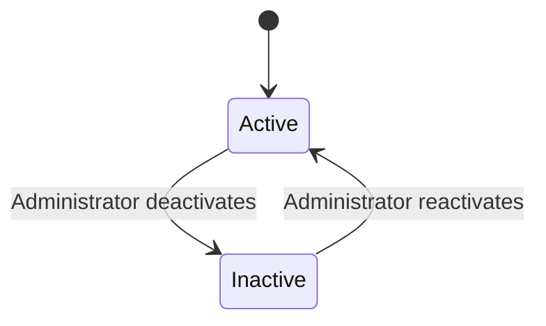

Valid:

```text
active ↔ inactive
```

User deactivation does not delete academic records.

---

## 2.2 Course Status

Recommended MVP business states:

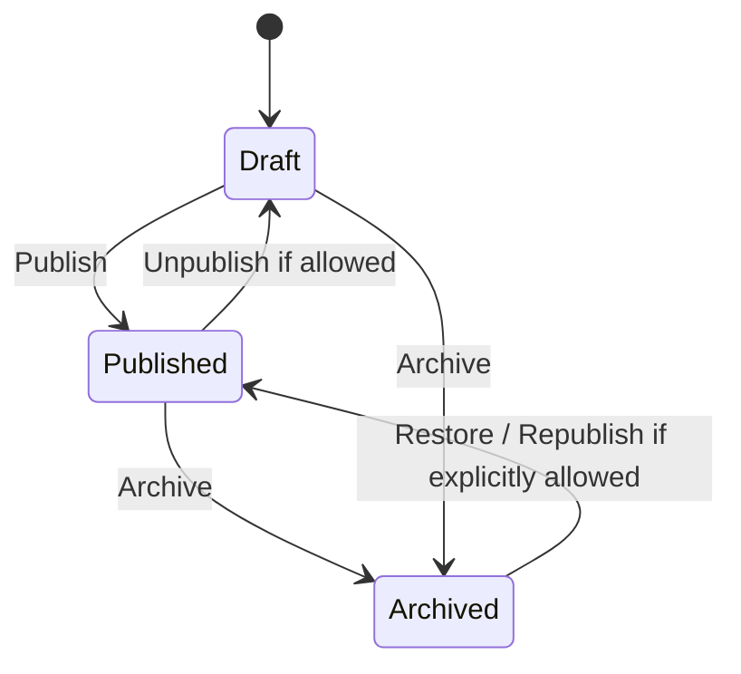

Minimum required behavior:

- Draft: not visible to Student.
- Published: potentially accessible according to visibility and enrollment.
- Archived: historical/read-only or restricted according to permission.

---

## 2.3 Enrollment Status

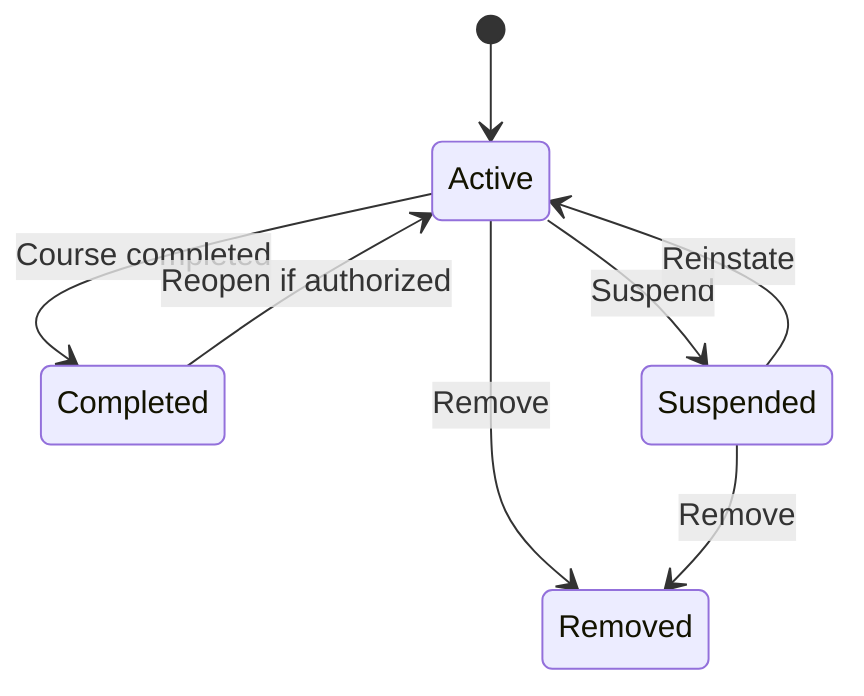

Valid states:

- active;
- completed;
- suspended;
- removed.

---

## 2.4 Lesson Status

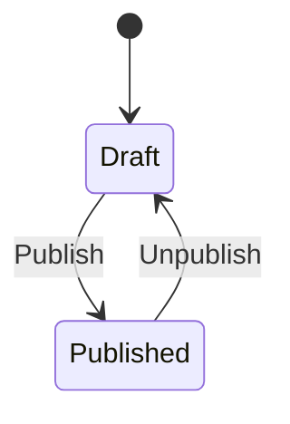

Draft lesson is not visible to Student.

---

## 2.5 Assignment Status

Recommended business states:

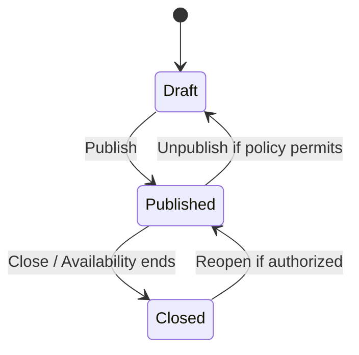

---

## 2.6 Submission Status

Business state representation may be derived partly from timestamps:

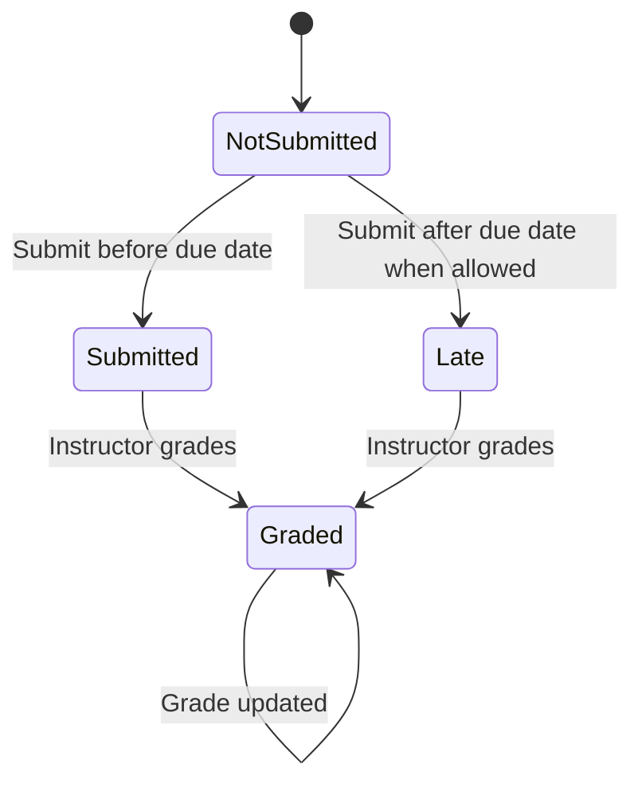

The authoritative submission timestamp is generated server-side.

---

## 2.7 Quiz Status

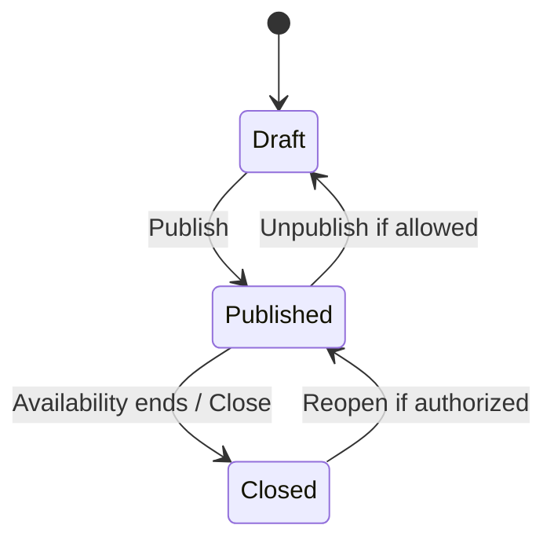

---

## 2.8 Quiz Attempt Status

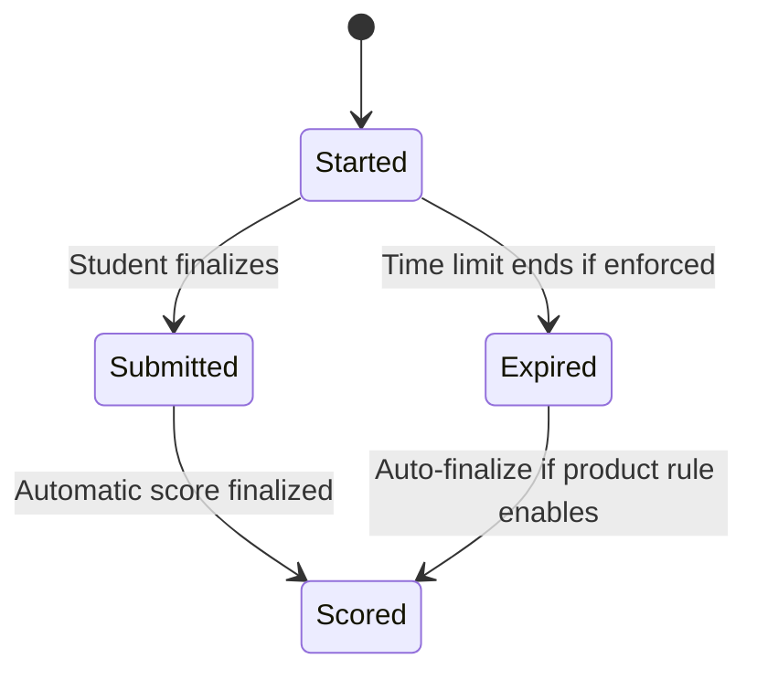

For MVP, attempt behavior must remain deterministic and never exceed configured attempt limit.

---

## 2.9 Grade Publication Status

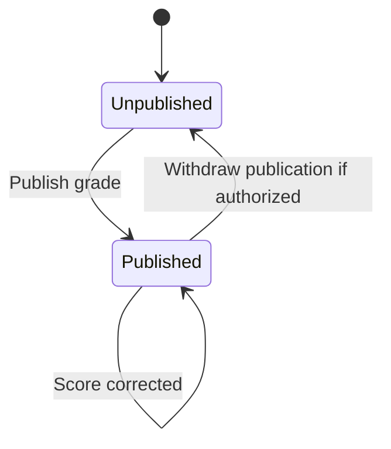

Student visibility depends on publication rule when grade publication control is enabled.

---

## 2.10 Discussion Thread Status

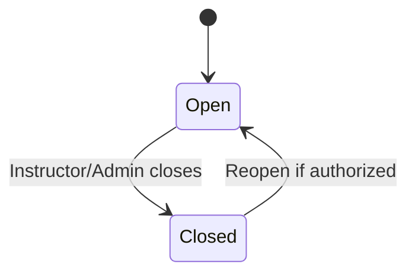

Closed thread does not accept new replies.

---

# 3. Workflow Applicability Matrix

| Generic Workflow | LearnFlow Applicability | Notes |
|---|---|---|
| User Registration | Adapted | MVP uses Admin-created user; public self-registration is not required |
| Authentication | Applicable | Login/logout/password reset |
| Main Transaction | Adapted | Learning transaction = Course participation, assignment submission, quiz attempt, grading |
| Approval Process | Limited | No formal approval chain; publication/grade visibility acts as controlled release |
| Payment | Not Applicable to MVP | Payment/subscription/e-commerce are out of scope |
| Cancellation | Adapted | Enrollment removal/suspension, course archive, activity closure |
| Status Changes | Applicable | User, Course, Enrollment, Lesson, Assignment, Quiz, Grade, Discussion |
| Inventory Movement | Not Applicable | LMS has no physical inventory domain |
| Notification | Applicable | In-app required, email optional |
| Reporting | Applicable | User, enrollment, activity, submission, grade, progress |
| Administration | Applicable | Users, roles, settings, branding, courses, audit |

---

# 4. Workflow — Institution Setup and Administration

## Trigger

Initial product setup or Administrator updates institution settings.

## Actor

- Administrator
- Super Administrator, if enabled

## Preconditions

- actor is authenticated;
- actor has institution/settings permission.

## Main Flow

1. Administrator opens Institution Settings.
2. System loads current institution settings.
3. Administrator updates allowed fields:
   - institution name;
   - logo;
   - favicon;
   - contact/profile information;
   - timezone;
   - default locale;
   - branding values supported by product.
4. System validates input.
5. System saves valid changes.
6. Relevant cached settings are invalidated.
7. System returns success confirmation.

## Alternative Flow

- Administrator only changes branding asset.
- Administrator changes timezone without changing other settings.
- Administrator cancels before save; no state changes occur.

## Error Flow

- invalid file type/size for logo;
- invalid timezone/locale;
- authorization denied;
- storage failure;
- database failure.

System must not report success when changes are not persisted.

## Business Rules

- standard branding must not require source-code changes;
- only authorized roles may change settings;
- protected configuration secrets are not managed as ordinary branding fields.

## Database State Changes

Potential changes:

- institution settings updated;
- branding file metadata created/updated;
- previous asset reference replaced according to retention policy.

## Notifications

None required by default.

## Audit Events

Recommended:

- institution settings updated;
- branding updated.

## Final State

Institution configuration is persisted and used by subsequent UI rendering.

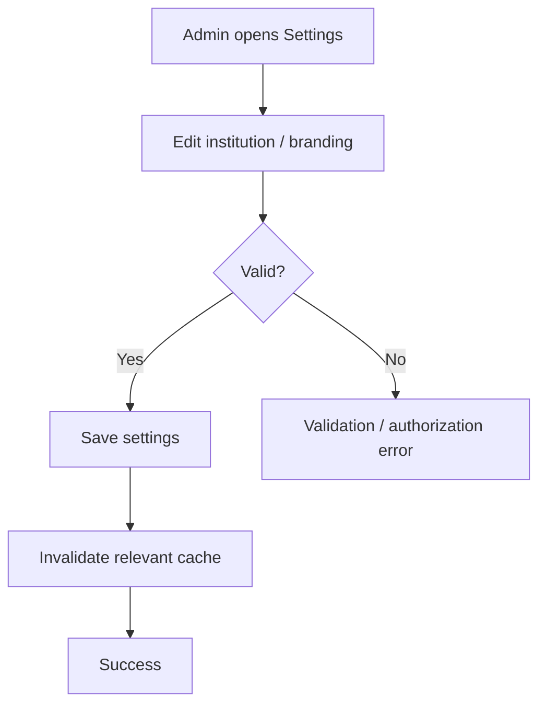

---

# 5. Workflow — User Creation / Registration

## Trigger

Administrator needs to onboard an Instructor or Student.

## Actor

- Administrator

## Preconditions

- Administrator authenticated;
- has user-management permission;
- target email/login identifier is not already in conflict with uniqueness rule.

## Main Flow

1. Administrator opens Create User.
2. Administrator enters:
   - name;
   - email/login identifier;
   - role;
   - optional profile fields.
3. System validates required fields and uniqueness.
4. Administrator submits.
5. System creates user in active state unless administrator explicitly selects another supported state.
6. System assigns role.
7. System records audit event.
8. System optionally sends account onboarding/reset-password email if configured.

## Alternative Flow

### A. CSV Import

1. Administrator uploads official CSV format.
2. System validates header.
3. System validates each row.
4. Valid rows create users.
5. Invalid rows are skipped/failed with reasons.
6. System shows summary.

### B. User Created Inactive

User is created but cannot authenticate until activated.

## Error Flow

- duplicate identifier;
- invalid role;
- invalid email;
- failed CSV row;
- authorization denied;
- transaction failure.

## Business Rules

- public self-registration is not part of MVP;
- unique login identifier must be enforced;
- a user must have a valid access role for normal LMS use;
- role changes are auditable.

## Database State Changes

- new user record;
- role assignment record;
- optional onboarding notification record;
- audit record.

## Notifications

Optional:

- account created;
- password setup/reset link.

## Audit Events

Mandatory:

- user created;
- initial role assigned.

## Final State

User exists and can authenticate if active and credential setup is complete.

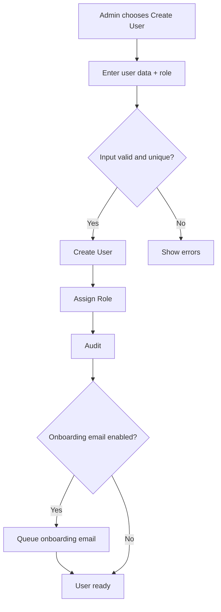

---

# 6. Workflow — Authentication

## Trigger

User attempts to access LearnFlow using credentials.

## Actor

- Administrator
- Instructor
- Student
- Manager/Viewer

## Preconditions

- user account exists;
- credential setup complete;
- user account active.

## Main Flow

1. User enters identifier and password.
2. System validates request shape.
3. System resolves user securely.
4. System verifies password.
5. System verifies active status.
6. System creates authenticated session.
7. System redirects to role-appropriate dashboard.

## Alternative Flow

### Password Reset

1. User requests reset.
2. System issues valid time-limited token.
3. Reset email is sent.
4. User follows token.
5. User sets new password.
6. Token becomes unusable.

## Error Flow

- invalid credentials;
- inactive account;
- expired reset token;
- reused token;
- session creation failure.

## Business Rules

- inactive users cannot authenticate;
- error should not unnecessarily disclose whether an account exists;
- logout must invalidate session.

## Database State Changes

Potential:

- password updated after reset;
- reset token lifecycle state;
- security/auth audit entries.

## Notifications

- password reset email.

## Audit Events

- relevant login/security event;
- password reset completion if tracked.

## Final State

Authenticated session exists, or user remains unauthenticated.

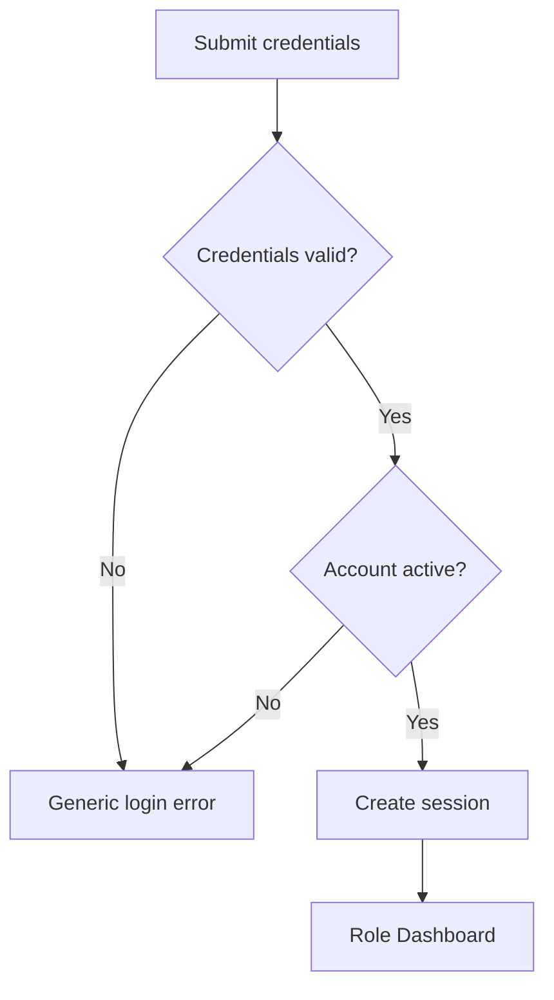

---

# 7. Workflow — User Deactivation / Reactivation

## Trigger

Administrator needs to disable or restore a user account.

## Actor

- Administrator

## Preconditions

- actor authorized;
- target user exists.

## Main Flow — Deactivate

1. Administrator opens user detail.
2. Administrator selects Deactivate.
3. System requests confirmation.
4. Administrator confirms.
5. User status changes `active → inactive`.
6. Academic history is retained.
7. User can no longer authenticate.
8. Audit event is recorded.

## Alternative Flow — Reactivate

1. Administrator selects Activate.
2. Status changes `inactive → active`.
3. Role and historical academic data remain intact unless separately changed.

## Error Flow

- user not found;
- actor lacks permission;
- protected account cannot be deactivated according to deployment rules;
- database failure.

## Business Rules

- deactivation does not delete submissions, grades, enrollments, or audit history.

## Database State Changes

- user status updated;
- audit record created.

## Notifications

Optional account status notice.

## Audit Events

Mandatory:

- user deactivated;
- user reactivated.

## Final State

User is active or inactive with history preserved.

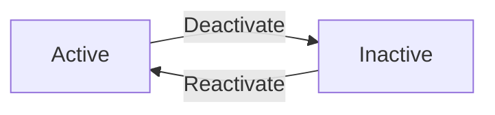

---

# 8. Workflow — Course Creation and Publication

## Trigger

Administrator creates a new Course.

## Actor

- Administrator
- Instructor only if future permission allows course creation

## Preconditions

- actor authenticated;
- actor has course-create permission.

## Main Flow

1. Actor opens Create Course.
2. Actor enters:
   - title;
   - code;
   - category;
   - description;
   - visibility.
3. System validates fields.
4. Course is created as Draft.
5. Instructor can be assigned.
6. Students can be enrolled as allowed by administration policy.
7. Course content can be prepared.
8. Authorized actor selects Publish.
9. System verifies publish requirements.
10. Course changes `draft → published`.
11. Eligible users can access it.

## Alternative Flow

- Course remains Draft for preparation.
- Course is archived before publishing.
- Published Course is unpublished if policy permits.

## Error Flow

- duplicate course code when uniqueness enabled;
- missing required fields;
- invalid category;
- unauthorized publish;
- persistence failure.

## Business Rules

- Draft Course cannot be viewed by Student.
- Private/enrolled-only Course requires active Enrollment.
- One Course can have multiple Instructors.

## Database State Changes

- Course created;
- category relationship saved;
- instructor relation created if assigned;
- status updated at publication;
- audit entries.

## Notifications

Optional:

- assigned Instructor informed;
- enrolled Students notified when Course published.

## Audit Events

- course created;
- course updated;
- course published/unpublished;
- course archived.

## Final State

Course is Draft, Published, or Archived.

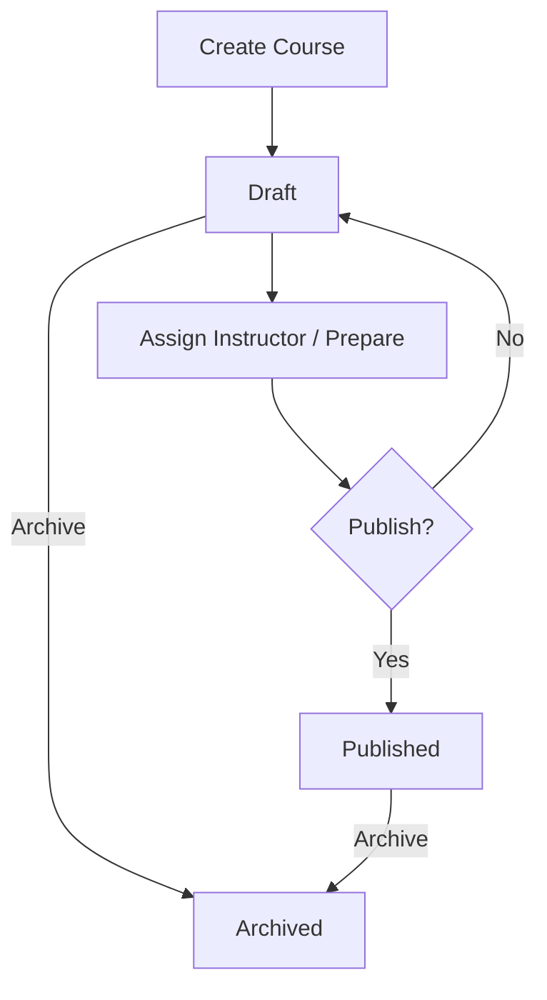

---

# 9. Workflow — Instructor Assignment

## Trigger

Administrator assigns an Instructor to a Course.

## Actor

- Administrator

## Preconditions

- Course exists;
- target user is eligible Instructor;
- Administrator has permission.

## Main Flow

1. Administrator opens Course staff/instructor configuration.
2. Selects Instructor.
3. System validates user eligibility.
4. System checks duplicate assignment.
5. Instructor-Course association is created.
6. Instructor receives Course management access according to permissions.

## Alternative Flow

- additional Instructor is assigned;
- Instructor assignment is removed.

## Error Flow

- user does not exist;
- user not eligible;
- duplicate assignment;
- authorization failure.

## Business Rules

- Instructor access is Course-scoped unless broader permission exists;
- removal from Course should not delete historical authorship/audit records.

## Database State Changes

- course instructor relation created/removed.

## Notifications

Optional Instructor assignment notification.

## Audit Events

Recommended:

- instructor assigned;
- instructor removed.

## Final State

Instructor is associated or no longer associated with Course.

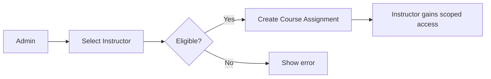

---

# 10. Workflow — Student Enrollment

## Trigger

Administrator enrolls Student into Course.

## Actor

- Administrator
- Instructor only if explicit enrollment permission is granted

## Preconditions

- Student exists;
- Course exists;
- actor is authorized;
- duplicate active enrollment does not already exist.

## Main Flow

1. Actor opens Course Enrollment.
2. Actor searches/selects Student.
3. System checks current enrollment.
4. Actor confirms enrollment.
5. System creates Enrollment with `active` status.
6. Student receives access to published Course content.
7. Audit record is created.
8. Optional notification is sent.

## Alternative Flow

- bulk enrollment;
- reactivate suspended enrollment;
- reopen completed enrollment if authorized.

## Error Flow

- duplicate active enrollment;
- invalid Student;
- invalid Course;
- unauthorized operation;
- Course archived and enrollment not allowed.

## Business Rules

- active enrollment grants Student eligibility for enrolled-only Course;
- suspended/removed enrollment blocks new access;
- historical activity is retained.

## Database State Changes

- Enrollment record created or status changed.

## Notifications

Optional:

- enrollment confirmation;
- Course available notification.

## Audit Events

Mandatory:

- enrollment created;
- enrollment status changed.

## Final State

Student has one of the valid Enrollment states.

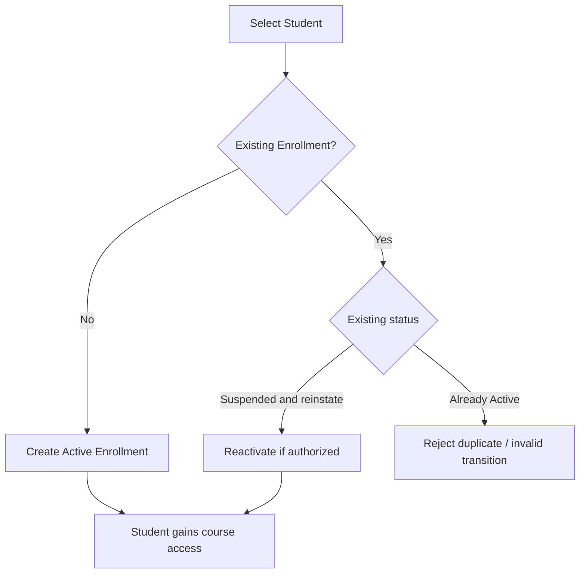

---

# 11. Workflow — Enrollment Status Change / Cancellation Equivalent

In LearnFlow, the generic concept of "cancellation" is represented primarily through Enrollment suspension/removal.

## Trigger

Participation must be suspended, completed, removed, or reopened.

## Actor

- Administrator
- authorized Instructor where permitted

## Preconditions

- Enrollment exists;
- actor has permission.

## Main Flow — Suspend

1. Actor selects Suspend.
2. System checks transition validity.
3. `active → suspended`.
4. Student loses access to new protected Course activities.
5. Historical data remains.

## Main Flow — Remove

1. Actor selects Remove.
2. Confirmation is required.
3. Enrollment becomes `removed`.
4. Student loses active participation access.
5. Existing historical records remain.

## Main Flow — Complete

1. Authorized workflow marks enrollment completed.
2. `active → completed`.
3. Completion status becomes reportable.

## Alternative Flow

- suspended → active;
- completed → active if Course is reopened and actor authorized.

## Error Flow

- invalid transition;
- missing Enrollment;
- insufficient permission.

## Business Rules

Valid transitions:

```text
active → completed
active → suspended
active → removed
suspended → active
suspended → removed
completed → active   [authorized reopen only]
```

## Database State Changes

Enrollment status and relevant timestamps updated.

## Notifications

Optional status change notification to Student.

## Audit Events

Mandatory status change event.

## Final State

Enrollment state reflects current participation without deleting history.

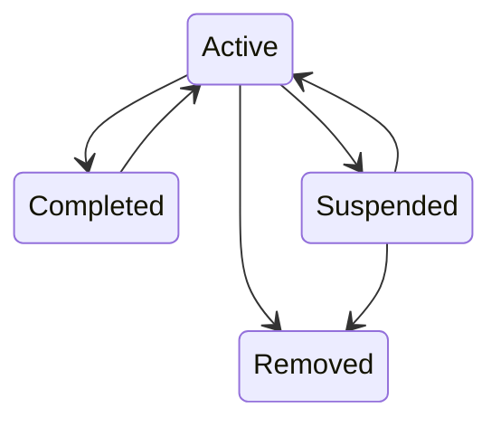

---

# 12. Workflow — Module and Lesson Authoring

## Trigger

Instructor prepares learning material.

## Actor

- Instructor
- Administrator

## Preconditions

- Course exists;
- Instructor is assigned or actor has broader permission.

## Main Flow

1. Instructor opens Course content.
2. Creates Module.
3. Sets Module order.
4. Creates Lesson inside Module.
5. Selects content type:
   - text;
   - resource/file;
   - external URL;
   - embedded link.
6. Saves Lesson as Draft.
7. Reviews content.
8. Publishes Lesson.
9. Student with eligible access can view it.

## Alternative Flow

- reorder Module;
- reorder Lesson;
- unpublish Lesson;
- replace attachment;
- keep Lesson as Draft.

## Error Flow

- invalid file;
- unauthorized Instructor;
- invalid URL/content;
- Lesson references incorrect Course/Module;
- storage failure.

## Business Rules

- Lesson belongs to one Module;
- Module belongs to one Course;
- Draft Lesson is invisible to Student;
- protected resources inherit Course access rules.

## Database State Changes

- Module create/update;
- Lesson create/update/status;
- file metadata/relation;
- ordering values.

## Notifications

Not required for every Lesson by default. Optional content-published notification can be added later.

## Audit Events

Recommended:

- significant content publish/unpublish;
- file/resource changes if audit policy includes them.

## Final State

Lesson is Draft or Published in ordered Course structure.

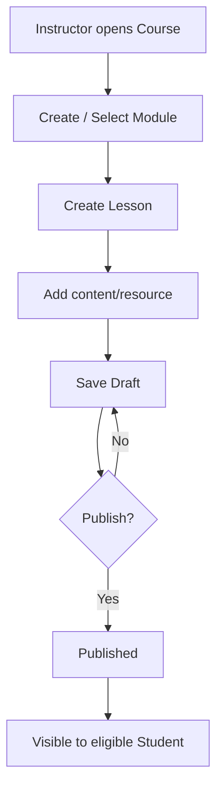

---

# 13. Workflow — Lesson Completion and Learning Progress

## Trigger

Student completes a completion-enabled Lesson.

## Actor

- Student
- System

## Preconditions

- Student authenticated;
- active Enrollment;
- Course and Lesson accessible;
- Lesson completion tracking enabled.

## Main Flow

1. Student opens Lesson.
2. Student completes the required completion action.
3. System verifies eligibility.
4. System creates/updates Lesson Completion record.
5. System calculates:
   - completed count;
   - total completion-enabled lessons.
6. Course progress percentage is updated/calculated.
7. Student dashboard reflects new progress.

## Alternative Flow

- completion is removed/reset if product rule permits;
- Course has no completion-enabled lessons, in which case progress behavior must use a documented neutral rule and avoid divide-by-zero.

## Error Flow

- Student not enrolled;
- Lesson unavailable;
- duplicate completion request;
- persistence failure.

## Business Rules

- progress must be 0–100%;
- only completion-enabled Lessons count;
- duplicate completion must not inflate progress.

## Database State Changes

- Lesson Completion create/update;
- optionally cached/denormalized progress state if architecture later requires it.

## Notifications

None required for each Lesson.

Future: Course completion notification.

## Audit Events

No mandatory audit for each routine lesson completion unless institution policy requires it.

## Final State

Student progress accurately reflects completion data.

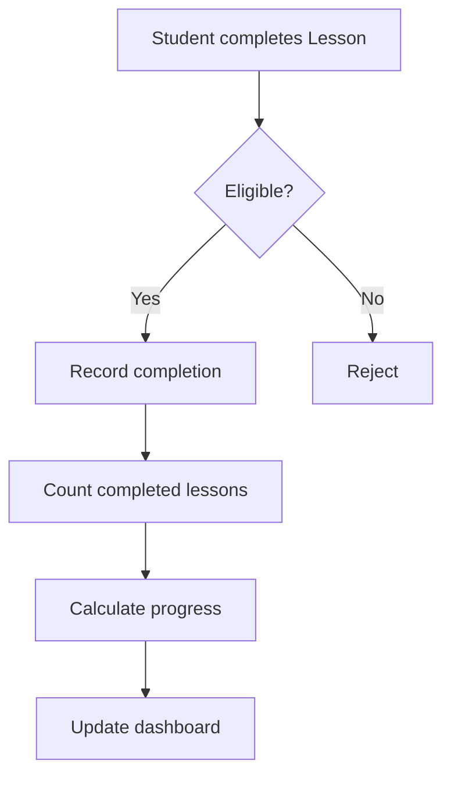

---

# 14. Workflow — Assignment Creation and Publication

## Trigger

Instructor needs to create assessed or non-assessed work.

## Actor

- Instructor
- Administrator

## Preconditions

- Course exists;
- actor can manage Course.

## Main Flow

1. Instructor opens Assignment section.
2. Creates Assignment.
3. Enters:
   - title;
   - instruction;
   - optional attachment;
   - optional due date;
   - maximum score;
   - submission mode;
   - late submission rule if supported.
4. Saves as Draft.
5. Reviews Assignment.
6. Publishes.
7. Assignment becomes visible to eligible Students.
8. Notification is generated if event enabled.

## Alternative Flow

- no due date;
- text-only submission;
- file-only submission;
- combined submission;
- unpublish before Student activity if policy allows;
- close/reopen.

## Error Flow

- invalid max score;
- invalid date range;
- attachment upload failure;
- unauthorized Course.

## Business Rules

- maximum score must be positive and valid;
- Student can only submit against published/available Assignment;
- draft Assignment is not actionable by Student.

## Database State Changes

- Assignment record;
- attachment metadata;
- publication/status timestamps.

## Notifications

Student notification when published if enabled.

## Audit Events

Recommended publish/status changes.

## Final State

Assignment is Draft, Published, or Closed.

```mermaid
flowchart TD
    A[Create Assignment]
    B[Configure]
    C[Save Draft]
    D{Publish?}
    E[Published]
    F[Notify eligible Students]
    G[Closed]

    A --> B --> C --> D
    D -- Yes --> E --> F
    D -- No --> C
    E -->|Close| G
```

---

# 15. Workflow — Assignment Submission

## Trigger

Student submits work.

## Actor

- Student

## Preconditions

- authenticated;
- active Enrollment;
- Assignment published/available;
- submission type allowed;
- late submission policy permits if due date has passed.

## Main Flow

1. Student opens Assignment.
2. System displays deadline and submission requirements.
3. Student enters text and/or uploads file.
4. System validates content/file.
5. System verifies current time against due date.
6. System determines normal or late state.
7. Student submits.
8. Server records authoritative submission timestamp.
9. Submission is persisted.
10. System returns success.
11. Optional Instructor notification is generated.

## Alternative Flow

### Late Submission

If current time > due date and late submission allowed:

- submission is accepted;
- status/indicator is Late.

### Resubmission

Only if future/explicit Assignment rule allows. It is not assumed automatically by MVP.

## Error Flow

- no active enrollment;
- Assignment unavailable;
- late submission not allowed;
- invalid file;
- upload failure;
- submission persistence failure.

Failed operation must not be shown as Submitted.

## Business Rules

- Student may not submit for another Student;
- server timestamp is authoritative;
- invalid file does not count as successful submission;
- late state is determined from server time.

## Database State Changes

- Submission create/update;
- submission file relation;
- submitted_at;
- late state.

## Notifications

Optional Instructor notification.

## Audit Events

Routine submission need not be a privileged audit event, but operational activity may be logged.

## Final State

Submission is Submitted or Late and eligible for grading.

```mermaid
flowchart TD
    A[Student opens Assignment]
    B{Active enrollment and available?}
    C[Enter text / upload file]
    D{Valid?}
    E{Past due date?}
    F{Late allowed?}
    G[Save Submitted]
    H[Save Late]
    I[Success]
    X[Reject]

    A --> B
    B -- No --> X
    B -- Yes --> C --> D
    D -- No --> X
    D -- Yes --> E
    E -- No --> G --> I
    E -- Yes --> F
    F -- No --> X
    F -- Yes --> H --> I
```

---

# 16. Workflow — Assignment Grading

## Trigger

Instructor reviews a submitted Assignment.

## Actor

- Instructor
- Administrator with grading permission

## Preconditions

- actor authorized for Course;
- Submission exists;
- Assignment defines maximum score.

## Main Flow

1. Instructor opens submission queue.
2. Filters pending submissions if desired.
3. Opens Student submission.
4. Reviews text/files.
5. Enters score.
6. Enters optional feedback.
7. System validates score range.
8. Grade is saved.
9. Grade publication state follows configured product rule.
10. Grade change is audited.
11. Student is notified when grade is published.

## Alternative Flow

- grade remains unpublished;
- published grade is corrected later;
- feedback is updated.

## Error Flow

- score > maximum;
- negative/invalid score;
- actor not assigned to Course;
- Submission missing;
- persistence failure.

## Business Rules

- score cannot exceed maximum;
- Student cannot grade;
- Student sees only own grade;
- grade change must be auditable.

## Database State Changes

- score/grade record created or updated;
- feedback updated;
- publication state;
- audit record.

## Notifications

Student receives grade-published notification.

## Audit Events

Mandatory:

- grade created;
- grade changed;
- grade publication changed where relevant.

## Final State

Submission has an authoritative grade and optional feedback.

```mermaid
flowchart TD
    A[Instructor opens Submission]
    B[Review work]
    C[Enter score + feedback]
    D{Score valid?}
    E[Save grade]
    F{Publish?}
    G[Published]
    H[Notify Student]
    U[Unpublished]
    X[Validation error]

    A --> B --> C --> D
    D -- No --> X
    D -- Yes --> E --> F
    F -- Yes --> G --> H
    F -- No --> U
```

---

# 17. Workflow — Quiz Creation and Publication

## Trigger

Instructor needs an automatically scored Quiz.

## Actor

- Instructor
- Administrator

## Preconditions

- Course exists;
- actor authorized.

## Main Flow

1. Instructor creates Quiz.
2. Enters:
   - title;
   - instruction;
   - optional duration;
   - attempt limit;
   - optional availability window.
3. Adds questions.
4. Selects question type:
   - Multiple Choice;
   - True/False.
5. Configures correct answer and weight.
6. Saves as Draft.
7. Reviews.
8. Publishes.
9. Eligible Students may attempt during allowed time.

## Alternative Flow

- no duration;
- no availability end;
- multiple attempts allowed according to configured limit;
- Quiz is closed/reopened.

## Error Flow

- invalid attempt limit;
- invalid availability window;
- no valid answer key;
- unauthorized actor.

## Business Rules

- only supported MVP question types allowed;
- each auto-gradable question must have valid correct answer configuration;
- draft Quiz cannot be attempted.

## Database State Changes

- Quiz;
- Questions;
- Answer options;
- correct answer/weight;
- status/availability.

## Notifications

Optional Quiz-published notification if enabled in product settings.

## Audit Events

Recommended:

- Quiz published;
- Quiz closed/reopened where meaningful.

## Final State

Quiz is Draft, Published, or Closed.

```mermaid
flowchart TD
    A[Create Quiz]
    B[Configure availability / attempts]
    C[Add Questions]
    D[Set answers + weights]
    E{Configuration valid?}
    F[Save Draft]
    G[Publish]
    H[Available to eligible Students]
    X[Validation errors]

    A --> B --> C --> D --> E
    E -- No --> X
    E -- Yes --> F --> G --> H
```

---

# 18. Workflow — Quiz Attempt and Automatic Scoring

## Trigger

Student starts a Quiz.

## Actor

- Student
- System

## Preconditions

- authenticated Student;
- active Enrollment;
- Quiz Published;
- within availability window;
- attempt limit not exhausted.

## Main Flow

1. Student selects Start Quiz.
2. System validates eligibility.
3. System creates Quiz Attempt with start time and attempt number.
4. Questions are presented.
5. Student answers.
6. Student submits final attempt.
7. System verifies attempt ownership and state.
8. System records answers.
9. System calculates score from correct answers and weights.
10. Attempt is finalized.
11. Submit time and final score are saved.
12. Grade representation is created/updated according to gradebook rule.
13. Result is displayed according to Quiz visibility rule.

## Alternative Flow

### Timed Attempt

If duration is configured:

- system tracks authoritative allowed duration;
- when time expires, behavior follows approved Quiz rule.

### Multiple Attempts

If attempts remain, Student may start another attempt.

Selection of final grade among multiple attempts must be explicitly defined before enabling advanced policies. MVP should use one clearly documented strategy.

## Error Flow

- availability not started;
- availability ended;
- attempt limit exceeded;
- attempt belongs to another user;
- already finalized;
- score finalization transaction fails.

## Business Rules

- attempt count must not exceed limit;
- score calculation must be deterministic;
- finalized attempt cannot be silently overwritten;
- Student cannot submit on behalf of another Student.

## Database State Changes

- Quiz Attempt;
- Quiz Answers;
- submitted_at;
- final score;
- grade record where applicable.

## Notifications

Optional grade/result notification when result is published.

## Audit Events

Grade changes are auditable; routine attempt may be operationally logged.

## Final State

Attempt is finalized/scored or rejected without producing false final state.

```mermaid
flowchart TD
    A[Start Quiz]
    B{Eligible and available?}
    C{Attempts remaining?}
    D[Create Attempt]
    E[Answer Questions]
    F[Submit]
    G{Attempt valid / not finalized?}
    H[Persist answers]
    I[Calculate score]
    J[Finalize attempt + grade]
    K[Show result according to rule]
    X[Reject]

    A --> B
    B -- No --> X
    B -- Yes --> C
    C -- No --> X
    C -- Yes --> D --> E --> F --> G
    G -- No --> X
    G -- Yes --> H --> I --> J --> K
```

---

# 19. Workflow — Grade Publication / Controlled Release

This is the closest MVP equivalent to an approval/release process.

## Trigger

Instructor decides a grade may become visible to Student.

## Actor

- Instructor
- Administrator with grade permission

## Preconditions

- grade exists;
- actor authorized;
- grade is currently unpublished if publication control is enabled.

## Main Flow

1. Instructor reviews grade.
2. Instructor selects Publish.
3. System validates authorization.
4. Grade state changes `unpublished → published`.
5. Student can view own grade.
6. Student receives notification.
7. Audit event is recorded.

## Alternative Flow

### Withdraw

Authorized actor may change `published → unpublished` if product policy permits.

### Grade Correction

Published score may be changed, but change must be audited.

## Error Flow

- unauthorized actor;
- grade not found;
- invalid publication state;
- persistence failure.

## Business Rules

- Student never sees another Student grade;
- publication control must be consistent across gradebook and dashboard;
- grade change after publication is auditable.

## Database State Changes

- publication status/timestamp;
- audit entry;
- notification record.

## Notifications

Grade published notification.

## Audit Events

Mandatory:

- publish/unpublish if tracked;
- score changes.

## Final State

Grade is Published or Unpublished.

```mermaid
stateDiagram-v2
    Unpublished --> Published: Publish
    Published --> Unpublished: Withdraw if authorized
    Published --> Published: Correct score + audit
```

---

# 20. Workflow — Announcement

## Trigger

Admin or Instructor communicates Course information.

## Actor

- Administrator
- Instructor

## Preconditions

- actor can manage target Course;
- Course exists.

## Main Flow

1. Actor creates Announcement.
2. Enters title/body.
3. Chooses Draft or Publish.
4. On publication, system resolves eligible Course audience.
5. Announcement becomes visible.
6. In-app notifications are created.
7. Email may be queued if enabled.

## Alternative Flow

- scheduled publication if scheduler feature enabled;
- edit before publication;
- keep Draft.

## Error Flow

- unauthorized Course;
- invalid schedule;
- message persistence failure;
- email failure after publication.

Email failure must not unpublish a successfully published Announcement.

## Business Rules

- only eligible Course users receive Course announcement;
- scheduled time uses configured timezone.

## Database State Changes

- Announcement;
- publication state;
- notification records.

## Notifications

Mandatory in-app if configured as product event; optional email.

## Audit Events

Recommended publication/status event.

## Final State

Announcement is Draft or Published.

```mermaid
flowchart TD
    A[Create Announcement]
    B[Save Draft]
    C{Publish now / schedule?}
    D[Publish]
    E[Resolve eligible audience]
    F[Create in-app notifications]
    G[Queue email if enabled]

    A --> B --> C
    C --> D --> E --> F --> G
```

---

# 21. Workflow — Course Discussion

## Trigger

Student or Instructor wants to discuss Course content.

## Actor

- Student
- Instructor
- Administrator

## Preconditions

- Discussion enabled for Course;
- Student has active Enrollment;
- thread open for new replies.

## Main Flow — New Thread

1. User opens Discussion.
2. System verifies Course access.
3. User creates thread.
4. System validates content.
5. Thread is stored as Open.
6. Eligible Course users can view it.

## Main Flow — Reply

1. User opens Open thread.
2. System checks permission and thread state.
3. User submits reply.
4. Reply is stored.

## Alternative Flow

Instructor/Admin closes thread.

## Error Flow

- Discussion disabled;
- Student not actively enrolled;
- thread closed;
- invalid content;
- authorization denied.

## Business Rules

- closed thread receives no new replies;
- Student cannot access discussion outside eligible Course.

## Database State Changes

- thread;
- reply;
- open/closed state.

## Notifications

Optional discussion reply notification; not mandatory MVP unless enabled.

## Audit Events

Thread closure/reopen may be audited depending on policy.

## Final State

Thread is Open or Closed.

```mermaid
flowchart TD
    A[Open Discussion]
    B{Discussion enabled + eligible?}
    C[Create Thread / Reply]
    D{Thread open?}
    E[Save]
    F[Visible to Course audience]
    X[Reject]

    A --> B
    B -- No --> X
    B -- Yes --> C --> D
    D -- No --> X
    D -- Yes --> E --> F
```

---

# 22. Workflow — Dashboard

## Trigger

Authenticated user enters LearnFlow or dashboard.

## Actor

- Administrator
- Instructor
- Student
- Manager/Viewer

## Preconditions

- authenticated session;
- valid role.

## Main Flow

1. System resolves current user and capabilities.
2. System selects dashboard context.
3. System queries only permitted summary data.
4. Dashboard displays role-specific widgets.

### Administrator

- active users;
- students;
- instructors;
- courses;
- active courses;
- recent activity;
- shortcuts.

### Instructor

- assigned courses;
- pending grading;
- upcoming deadlines;
- recent course activity.

### Student

- active enrolled courses;
- upcoming assignments/quizzes;
- course progress;
- recent published grades;
- announcements.

## Alternative Flow

No data exists → empty state and relevant action/help message.

## Error Flow

- authorization failure;
- query failure;
- stale cache issue must fall back safely where possible.

## Business Rules

- dashboard is not allowed to expose data beyond role scope;
- Student grades shown only when published.

## Database State Changes

None for ordinary view.

## Notifications

Dashboard may display unread notifications.

## Audit Events

Ordinary dashboard view does not require business audit.

## Final State

User receives role-appropriate operational overview.

```mermaid
flowchart TD
    A[Authenticated User]
    B{Role}
    C[Admin Dashboard]
    D[Instructor Dashboard]
    E[Student Dashboard]
    F[Manager Dashboard]
    G[Scoped Queries]
    H[Render]

    A --> B
    B --> C
    B --> D
    B --> E
    B --> F
    C --> G
    D --> G
    E --> G
    F --> G
    G --> H
```

---

# 23. Workflow — Reporting

## Trigger

Authorized user needs operational or academic information.

## Actor

- Administrator
- Instructor
- Manager/Viewer

## Preconditions

- authenticated;
- report permission;
- Course scope valid where relevant.

## Main Flow

1. User selects report type.
2. System displays allowed filters.
3. User sets filters.
4. System validates filter values.
5. System applies authorization scope.
6. System executes report query.
7. Results are paginated/aggregated.
8. User reviews report.
9. User may export CSV if permitted.

## Alternative Flow

### Large Export

1. Export request is accepted.
2. Background job generates file.
3. User receives completion indication/notification.
4. File is available for authorized download until expiry.

## Error Flow

- invalid date range;
- unauthorized scope;
- export generation failure;
- no data.

No-data result is an empty report, not a system error.

## Business Rules

- report is read-only;
- export must match active filters and permission scope;
- Student does not gain administrative report access.

## Database State Changes

Ordinary report view: none.

Export may create:

- export job/status;
- temporary file metadata;
- notification record.

## Notifications

Optional export-ready notification.

## Audit Events

Sensitive export may be audited depending on deployment policy.

## Final State

Authorized report is displayed or export generated.

```mermaid
flowchart TD
    A[Select Report]
    B[Choose Filters]
    C{Valid?}
    D[Apply permission scope]
    E[Query data]
    F{Data found?}
    G[Display Report]
    H[Empty State]
    I{Export?}
    J[Generate CSV]
    X[Filter error]

    A --> B --> C
    C -- No --> X
    C -- Yes --> D --> E --> F
    F -- Yes --> G --> I
    F -- No --> H
    I -- Yes --> J
```

---

# 24. Workflow — User Import

## Trigger

Administrator needs bulk user creation.

## Actor

- Administrator

## Preconditions

- user import permission;
- CSV file available;
- file follows supported format.

## Main Flow

1. Administrator downloads/views official template.
2. Uploads CSV.
3. System validates file and header.
4. System reads rows.
5. Each row is validated:
   - required fields;
   - identifier uniqueness;
   - role validity.
6. Valid rows are created.
7. Invalid rows are skipped/failed.
8. System returns summary:
   - successful;
   - skipped;
   - failed.
9. Failure reasons are available.

## Alternative Flow

Large import is queued.

## Error Flow

- invalid file;
- invalid header;
- file too large;
- all rows invalid;
- queue/import failure.

## Business Rules

- one failed row must not necessarily invalidate all independent valid rows unless import mode is explicitly atomic;
- duplicate identifiers cannot violate uniqueness.

## Database State Changes

- user records;
- role assignments;
- optional import job metadata;
- audit records.

## Notifications

Optional import-complete notification for queued imports.

## Audit Events

Recommended:

- bulk user import;
- created user events may be grouped according to audit policy.

## Final State

Valid users are available; errors are clearly reported.

```mermaid
flowchart TD
    A[Upload CSV]
    B{Header valid?}
    C[Process Rows]
    D{Row valid?}
    E[Create User + Role]
    F[Record Row Failure]
    G[Summary]
    X[Reject File]

    A --> B
    B -- No --> X
    B -- Yes --> C --> D
    D -- Yes --> E --> C
    D -- No --> F --> C
    C -->|Complete| G
```

---

# 25. Workflow — File Upload and Protected Download

## Trigger

User attaches Course resource or Student Submission.

## Actor

- Administrator
- Instructor
- Student

## Preconditions

- actor authorized for the parent resource;
- file meets context rules.

## Main Flow — Upload

1. User selects file.
2. System authorizes parent resource.
3. System validates:
   - size;
   - MIME/type;
   - context.
4. File is stored with safe internal identity.
5. Metadata is saved.
6. File is related to parent resource.
7. System confirms success.

## Main Flow — Download

1. User requests file.
2. System resolves metadata.
3. System authenticates user.
4. System authorizes parent resource.
5. File is streamed/provided through protected access.

## Alternative Flow

Public branding assets may be directly public according to configuration.

## Error Flow

- invalid type;
- excessive size;
- storage failure;
- metadata persistence failure;
- unauthorized download.

## Business Rules

- protected files cannot rely on guessable public URL authorization;
- failed upload is never treated as valid Submission.

## Database State Changes

- file metadata;
- parent relation;
- optionally old file relation removed/replaced.

## Notifications

None required by file operation itself.

## Audit Events

Only when file action is part of auditable business operation.

## Final State

File exists and access follows parent-resource authorization.

```mermaid
flowchart TD
    A[Upload File]
    B{Authorized?}
    C{Valid size/type?}
    D[Store Private File]
    E[Save Metadata]
    F[Relate to Resource]
    G[Success]
    X[Reject]

    A --> B
    B -- No --> X
    B -- Yes --> C
    C -- No --> X
    C -- Yes --> D --> E --> F --> G
```

---

# 26. Workflow — Notification Delivery

## Trigger

A supported business event completes successfully.

## Actor

- System
- Recipient user

## Preconditions

- triggering domain operation succeeded;
- recipient eligibility can be resolved.

## Main Flow

1. Domain operation commits.
2. System identifies event type.
3. System resolves recipients.
4. System creates in-app notification.
5. If email enabled:
   - email work is queued;
   - worker attempts delivery.
6. User sees unread notification.
7. User opens notification.
8. Notification becomes read according to UI behavior.

## Alternative Flow

- email disabled → in-app only;
- email fails → in-app notification remains valid.

## Error Flow

- no eligible recipient;
- queue unavailable;
- SMTP failure.

## Business Rules

- notification delivery failure must not invalidate academic transaction;
- users must not receive Course notifications outside their eligible scope.

## Database State Changes

- notification record;
- read timestamp/state;
- optional queued job metadata.

## Notifications

This workflow is itself the notification process.

## Audit Events

Not required for ordinary notifications.

## Final State

Notification is unread/read; optional email has delivered or failed independently.

```mermaid
flowchart LR
    Event[Committed Event]
    Recipients[Resolve Recipients]
    InApp[Create In-App]
    Email{Email enabled?}
    Queue[Queue Email]
    Delivered[Delivery Attempt]
    Read[User Reads]

    Event --> Recipients --> InApp --> Read
    Recipients --> Email
    Email -- Yes --> Queue --> Delivered
```

---

# 27. Workflow — Audit Trail

## Trigger

A critical auditable business operation occurs.

## Actor

- System records
- Administrator views

## Preconditions

- triggering operation belongs to configured mandatory audit category.

## Main Flow

1. Critical operation is authorized.
2. Business operation executes.
3. System records audit data:
   - actor;
   - action;
   - target;
   - timestamp;
   - summary;
   - relevant before/after values.
4. Authorized Administrator may later search/view audit records.

## Alternative Flow

Actor may later be inactive; audit still retains interpretable actor reference/history.

## Error Flow

If audit persistence fails for a critical operation, handling must follow documented critical-audit policy. The system must not falsely present the operation as fully audited.

## Business Rules

Mandatory audit categories:

- user create/update/deactivate;
- role/permission changes;
- course create/update/archive;
- enrollment changes;
- grade create/change.

## Database State Changes

Append audit record.

## Notifications

Optional security/administrative alerts are future scope.

## Audit Events

The output is the audit event.

## Final State

Immutable audit record exists and is viewable only by authorized role.

```mermaid
flowchart TD
    A[Critical Operation]
    B[Execute Business Change]
    C[Create Audit Record]
    D[(Audit Store)]
    E[Authorized Audit Viewer]

    A --> B --> C --> D
    E --> D
```

---

# 28. Workflow — Course Completion and Archive

## Trigger

Course instruction period is finished.

## Actor

- Administrator
- authorized Instructor for selected completion operations

## Preconditions

- Course exists;
- actor authorized.

## Main Flow

1. Instructor/Admin reviews progress and grades.
2. Eligible Enrollment may be changed `active → completed`.
3. Remaining grading is finalized according to institution workflow.
4. Reports remain available.
5. Administrator archives Course.
6. Course becomes historical and no longer operates as an active learning Course.
7. Academic data remains retained.

## Alternative Flow

Course may be reopened/republished if policy permits.

## Error Flow

- unauthorized archive;
- invalid Course state;
- persistence failure.

## Business Rules

- archive must not delete academic history;
- archived Course remains reportable;
- access to archived Course is controlled by permission.

## Database State Changes

- Enrollment statuses may become Completed;
- Course status becomes Archived;
- audit record.

## Notifications

Optional Course completion notification.

## Audit Events

Mandatory/recommended:

- Enrollment completed;
- Course archived;
- Course restored if applicable.

## Final State

Course is Archived with historical academic records intact.

```mermaid
flowchart TD
    A[Course period ends]
    B[Review outstanding grades/progress]
    C[Complete eligible enrollments]
    D[Generate final reports]
    E[Archive Course]
    F[Historical / reportable state]

    A --> B --> C --> D --> E --> F
```

---

# 29. Workflow — Search and Filtering

## Trigger

User searches users, Courses, Enrollments, Submissions, or reports.

## Actor

Any authorized user according to resource.

## Preconditions

- authenticated where resource is protected;
- permission to view target data.

## Main Flow

1. User enters search/filter criteria.
2. System validates/normalizes input.
3. System applies authorization scope.
4. System applies search/filter.
5. System paginates results.
6. Results are displayed.

## Alternative Flow

No match → empty state.

## Error Flow

Invalid filter/date format → validation feedback.

## Business Rules

Search must never broaden user access.

## Database State Changes

None.

## Notifications

None.

## Audit Events

Ordinary search is not audited by default.

## Final State

Scoped result list or empty state.

```mermaid
flowchart LR
    Input[Search / Filter]
    Validate[Validate]
    Scope[Apply Authorization Scope]
    Query[Query]
    Page[Paginate]
    Result[Results / Empty State]

    Input --> Validate --> Scope --> Query --> Page --> Result
```

---

# 30. Workflow — Role and Permission Administration

## Trigger

Administrator needs to modify access capability.

## Actor

- Administrator
- Super Administrator if deployment differentiates them

## Preconditions

- actor has role/permission-management permission.

## Main Flow

1. Administrator opens role/access configuration.
2. Selects role or user assignment.
3. Reviews current capabilities.
4. Changes allowed capabilities or role assignment.
5. System validates that the change is permitted.
6. System persists change.
7. Permission cache is invalidated if used.
8. Audit event is recorded.

## Alternative Flow

- create custom role if product version supports it;
- restore previous permission manually.

## Error Flow

- actor tries to grant capability they are not allowed to manage;
- invalid role;
- protected role restrictions;
- persistence failure.

## Business Rules

- permission enforcement is server-side;
- role assignment changes must be auditable;
- menu visibility is not authorization.

## Database State Changes

- role/permission relation;
- user-role relation;
- audit record.

## Notifications

Not required by default.

## Audit Events

Mandatory:

- role assignment changed;
- permission changed.

## Final State

Access behavior reflects updated capability after change/cache invalidation.

```mermaid
flowchart TD
    A[Open Access Control]
    B[Select Role/User]
    C[Change Capability]
    D{Allowed change?}
    E[Persist]
    F[Invalidate permission cache]
    G[Audit]
    X[Reject]

    A --> B --> C --> D
    D -- No --> X
    D -- Yes --> E --> F --> G
```

---

# 31. Workflow — Error and Recovery Handling

## Trigger

A user or system operation fails.

## Actor

- System
- User
- Administrator/operator

## Preconditions

An operation encounters validation, authorization, business-rule, integration, or technical failure.

## Main Flow

1. System classifies error.
2. If user-correctable:
   - display clear error;
   - preserve valid input where practical.
3. If authorization:
   - deny access without exposing protected data.
4. If technical:
   - show generic user-safe message;
   - write internal log.
5. If transaction was active:
   - rollback.
6. User may retry if safe.

## Alternative Flow

Non-critical email/notification failure occurs after core transaction:

- academic transaction remains successful;
- delivery failure is logged/retried.

## Error Flow

If logging itself fails, infrastructure monitoring/operational policy must address it.

## Business Rules

- failed Submission cannot show Submitted;
- failed Quiz finalization cannot show final grade;
- stack traces are not displayed in production.

## Database State Changes

Depends on operation; rollback prevents partial state where transaction is required.

## Notifications

Optional operational alert to administrators is future/deployment capability.

## Audit Events

Critical failed security actions may be logged separately from business audit.

## Final State

System remains consistent and user receives safe outcome.

```mermaid
flowchart TD
    A[Operation]
    B{Error type}
    C[Validation Feedback]
    D[Access Denied]
    E[Business Rule Error]
    F[Technical Exception]
    G[Rollback if needed]
    H[Internal Log]
    I[Safe User Message]

    A --> B
    B --> C
    B --> D
    B --> E
    B --> F --> G --> H --> I
```

---

# 32. Payment Workflow

## Applicability

**Not Applicable to LearnFlow LMS MVP.**

Payment gateway, Course e-commerce, subscriptions, and SaaS billing are explicitly outside MVP scope.

No Payment business state, payment transaction, refund, or settlement process should be created in the initial product.

Future commercial versions may define a separate billing bounded context.

---

# 33. Formal Approval Workflow

## Applicability

A general multi-step approval engine is **not included in MVP**.

MVP uses controlled state transitions instead:

```text
Course Draft → Published
Lesson Draft → Published
Assignment Draft → Published
Quiz Draft → Published
Grade Unpublished → Published
```

These transitions require authorization but are not a separate generic approval workflow.

A future enterprise edition may add:

```text
Draft
→ Submitted for Review
→ Approved
→ Published
```

only if customer demand validates the requirement.

---

# 34. Inventory Movement Workflow

## Applicability

**Not Applicable.**

LearnFlow LMS manages digital learning resources, not physical inventory.

File storage lifecycle is covered separately and should not be modeled as stock/inventory movement.

---

# 35. Major Cross-Module End-to-End Flow

```mermaid
flowchart TD
    A[Admin configures Institution]
    B[Admin creates Users]
    C[Admin creates Course]
    D[Admin assigns Instructor]
    E[Admin enrolls Students]
    F[Instructor creates Modules / Lessons]
    G[Instructor publishes Learning Content]
    H[Student learns]
    I[Instructor creates Assignment / Quiz]
    J[Student submits / attempts]
    K[System or Instructor grades]
    L[Grade published]
    M[Progress updated]
    N[Reports generated]
    O[Enrollment completed]
    P[Course archived]

    A --> B --> C --> D --> E --> F --> G --> H --> I --> J --> K --> L --> M --> N --> O --> P
```

---

# 36. Business Invariants

The following rules must remain true across all workflows:

### BI-001
An inactive User cannot authenticate.

### BI-002
A Student cannot access an enrolled-only Course without Active Enrollment.

### BI-003
A Draft Course or Draft Lesson is not visible to Student.

### BI-004
An Instructor cannot manage Course-scoped resources outside assigned Course unless explicitly permitted.

### BI-005
A Student cannot access another Student's grade or submission.

### BI-006
An Assignment score cannot exceed maximum score.

### BI-007
A Quiz attempt cannot exceed configured attempt limit.

### BI-008
A finalized Quiz Attempt must not be finalized twice.

### BI-009
Submission timestamp is authoritative server state.

### BI-010
Academic history is not deleted merely because User is inactive.

### BI-011
Course archive must not remove reporting history.

### BI-012
Grade changes must be auditable.

### BI-013
Role/permission changes must be auditable.

### BI-014
Enrollment status changes must be auditable.

### BI-015
Notification delivery failure must not reverse a committed academic transaction.

### BI-016
Reporting must never bypass authorization scope.

### BI-017
Cache must not be the source of truth.

### BI-018
Failed operations must not leave a misleading successful status.

---

# 37. Final Workflow Summary

LearnFlow LMS MVP is operationally complete when the following loop works end-to-end:

```text
ADMINISTRATION
Create users
→ Configure roles
→ Create Course
→ Assign Instructor
→ Enroll Students

TEACHING
Create Module
→ Create Lesson
→ Publish content
→ Create Assignment / Quiz

LEARNING
Student accesses Course
→ Completes Lessons
→ Submits Assignment
→ Attempts Quiz

ASSESSMENT
Instructor grades Assignment
→ System auto-scores Quiz
→ Grade is published
→ Student sees result

MONITORING
Progress updates
→ Dashboard updates
→ Reports show Course activity

CLOSURE
Enrollment completed
→ Course archived
→ Historical records retained
```

This flow intentionally excludes payment, marketplace, physical inventory, native mobile operations, multi-tenant billing, and generic approval engines from the MVP.
