# DATABASE DESIGN — LearnFlow LMS

## Document Information

| Field | Value |
|---|---|
| Product | LearnFlow LMS |
| Document | Database Design |
| Version | 1.0 |
| Source Requirements | `docs/PRD.md`, `docs/SRS.md`, `docs/SYSTEM_DESIGN.md`, `docs/BUSINESS_FLOW.md` |
| Requested Database | MySQL 8.4.x |
| Verified Actual Database Version | **TBD — Requires Environment Verification** |
| ORM Direction | Laravel Eloquent |
| Architecture | Laravel Modular Monolith |
| Scope | MVP database design; no migrations yet |

> `docs/PRD.md` remains the authoritative product requirement. This document defines the relational model needed to support those requirements without expanding the MVP into billing, marketplace, multi-tenancy, SCORM, AI, or other out-of-scope domains.

---

# 1. Database Design Principles

## 1.1 Relational Source of Truth

MySQL is the authoritative source of persistent LearnFlow application state.

The database must preserve:

- user identity;
- access-control relationships;
- Course structure;
- Enrollment state;
- academic content;
- Submission history;
- Quiz Attempt history;
- Grades;
- learner Progress facts;
- communications;
- notification state;
- audit records;
- file metadata.

Cache, queue, search results, generated reports, and temporary exports are not sources of truth.

## 1.2 Normalize Core Academic Data

Core entities are normalized around clear domain relationships.

Examples:

```text
Course
→ Module
→ Lesson

Course
→ Assignment
→ Submission
→ Grade

Course
→ Quiz
→ Question
→ Answer Option
→ Quiz Attempt
→ Quiz Answer
→ Grade
```

Avoid:

- storing comma-separated IDs;
- storing authoritative relations only inside JSON;
- duplicating Enrollment state in multiple tables;
- storing a second "grade status" where the same state can be safely derived.

## 1.3 Preserve Academic History

The schema must prefer:

- `status`;
- `archived_at`;
- `completed_at`;
- `suspended_at`;
- `removed_at`;
- `published_at`;

over destructive deletion for academic records.

Examples:

- User deactivation must not delete grades.
- Enrollment removal must not delete Submission history.
- Course archive must not remove Reporting history.

## 1.4 Foreign Keys Where Relationship Is Concrete

Concrete relational links should use foreign keys.

Examples:

- `enrollments.course_id → courses.id`;
- `enrollments.user_id → users.id`;
- `lessons.module_id → modules.id`;
- `submissions.assignment_id → assignments.id`.

Generic cross-domain logs may use type/id references where a normal foreign key cannot represent multiple target tables.

## 1.5 Business Rules at Both Application and Database Levels

Database constraints should enforce invariants that are stable and relational.

Application logic still enforces:

- permission scope;
- Course visibility;
- attempt-limit eligibility;
- conditional Course code uniqueness;
- valid status transitions;
- question correctness rules;
- grade publication behavior.

## 1.6 Laravel-Friendly Naming

Use:

- plural snake_case table names;
- `id` as primary key;
- `<entity>_id` foreign keys;
- `created_at`, `updated_at`;
- explicit business timestamps such as `submitted_at`, `published_at`, `graded_at`.

## 1.7 Avoid Premature Multi-Tenancy

MVP is a single-organization deployment.

The schema may contain an `institutions` table because institution identity and branding are product requirements, but the design must **not** add `institution_id` to every business table before SaaS tenancy is formally designed.

## 1.8 Avoid Premature Generic Abstractions

Do not create:

- generic `entities`;
- generic `activities` table for all learning activities;
- generic polymorphic grade source as the only academic reference;
- generic EAV tables for Course/User academic data.

Flexible JSON is reserved for settings, notification payloads, and audit metadata where schema variability is expected.

---

# 2. Entity List

## 2.1 Core Platform Entities

1. `institutions`
2. `institution_settings`
3. `users`
4. `password_reset_tokens`
5. `roles`
6. `permissions`
7. `role_user`
8. `permission_role`
9. `files`
10. `notifications`
11. `activity_logs`

## 2.2 LMS Domain Entities

12. `course_categories`
13. `courses`
14. `course_instructors`
15. `enrollments`
16. `modules`
17. `lessons`
18. `lesson_completions`
19. `assignments`
20. `assignment_files`
21. `submissions`
22. `submission_files`
23. `quizzes`
24. `questions`
25. `answer_options`
26. `quiz_attempts`
27. `quiz_answers`
28. `grades`
29. `announcements`
30. `discussion_threads`
31. `discussion_replies`

## 2.3 Conditional Laravel Operational Tables

These depend on the verified environment driver and are not mandatory business tables:

- `sessions` — only if database session driver is selected;
- `jobs` — only if database queue driver is selected;
- `job_batches` — only if Laravel batch jobs are used;
- `failed_jobs` — if failed job persistence is selected;
- `cache` and `cache_locks` — only if database cache driver is selected.

Driver selection remains **TBD — Requires Environment Verification**.

---

# 3. Table Descriptions

| Table | Purpose |
|---|---|
| `institutions` | Stores the self-hosted institution identity and core branding/profile data. |
| `institution_settings` | Stores configurable institution/application settings that do not justify dedicated columns. |
| `users` | Stores LMS user accounts. |
| `password_reset_tokens` | Supports password-reset lifecycle. |
| `roles` | Defines access roles such as Administrator, Instructor, Student. |
| `permissions` | Defines fine-grained capabilities. |
| `role_user` | Assigns roles to users. |
| `permission_role` | Assigns permissions to roles. |
| `files` | Stores metadata for files managed by LearnFlow. |
| `notifications` | Stores Laravel-style in-app notifications. |
| `activity_logs` | Stores append-only audit/security-relevant business events. |
| `course_categories` | Classifies Courses. |
| `courses` | Stores Course master data and lifecycle state. |
| `course_instructors` | Maps Instructor users to Courses. |
| `enrollments` | Stores learner participation and Enrollment status. |
| `modules` | Organizes Course Lessons. |
| `lessons` | Stores published/draft learning content. |
| `lesson_completions` | Stores Student completion facts for Lessons. |
| `assignments` | Stores Course Assignment definitions. |
| `assignment_files` | Associates reusable file metadata with Assignment attachments. |
| `submissions` | Stores Student Assignment submissions. |
| `submission_files` | Associates Submission files. |
| `quizzes` | Stores Quiz definitions and availability. |
| `questions` | Stores Quiz questions. |
| `answer_options` | Stores candidate answers for MCQ/True-False questions. |
| `quiz_attempts` | Stores each Student Quiz attempt. |
| `quiz_answers` | Stores answers within a Quiz Attempt. |
| `grades` | Stores the authoritative Course gradebook value for Assignment/Quiz activities. |
| `announcements` | Stores Course announcements and publication state. |
| `discussion_threads` | Stores Course discussion topics. |
| `discussion_replies` | Stores replies in discussion threads. |

---

# 4. Column Definitions

The following sections provide the logical table specification.

Data types are designed for the requested MySQL 8.4 target. Actual environment compatibility must be verified before migrations are generated.

---

# 5. Data Types

General conventions:

| Data Kind | Recommended Type |
|---|---|
| Primary/foreign identifiers | `BIGINT UNSIGNED` |
| Short names/titles | `VARCHAR(255)` |
| Codes | `VARCHAR(100)` |
| Status/type identifiers | `VARCHAR(30-50)` |
| Long text/content | `TEXT` or `LONGTEXT` |
| Boolean | `BOOLEAN` / `TINYINT(1)` |
| Scores | `DECIMAL(8,2)` |
| File size | `BIGINT UNSIGNED` |
| Structured flexible data | `JSON` |
| Timestamps | `TIMESTAMP` or Laravel-compatible timestamp |
| IP address | `VARCHAR(45)` |
| UUID notification ID | `CHAR(36)` |

Do not use floating-point types for scores or future financial values.

---

# 6. Primary Keys

Default business table primary key:

```text
id BIGINT UNSIGNED AUTO_INCREMENT PRIMARY KEY
```

Exception:

- `notifications.id` may use `CHAR(36)` UUID to align with Laravel database notification convention.
- `password_reset_tokens` may use email as the lookup key according to Laravel's conventional reset-token schema rather than a numeric entity ID.

Primary key design may be adjusted to the exact Laravel version after environment verification.

---

# 7. Foreign Keys

Foreign keys should use matching unsigned types and explicit delete behavior.

Preferred rules:

- `RESTRICT` for academic parent records where deletion would destroy history;
- `CASCADE` for pure dependent child records that have no meaning without parent;
- `SET NULL` where historical record must remain after optional actor/reference removal.

Examples:

```text
modules.course_id               → courses.id
lessons.module_id               → modules.id
submissions.assignment_id       → assignments.id
quiz_attempts.quiz_id           → quizzes.id
quiz_answers.quiz_attempt_id    → quiz_attempts.id
grades.user_id                  → users.id
```

Foreign-key delete rules are specified per table.

---

# 8. Unique Constraints

Stable unique constraints:

- `users.email`;
- `roles.name`;
- `permissions.name`;
- `role_user (role_id, user_id)`;
- `permission_role (permission_id, role_id)`;
- `course_instructors (course_id, user_id)`;
- `enrollments (course_id, user_id)`;
- `lesson_completions (lesson_id, user_id)`;
- `submissions (assignment_id, user_id)` for MVP;
- `quiz_attempts (quiz_id, user_id, attempt_number)`;
- `quiz_answers (quiz_attempt_id, question_id)`;
- `grades (assignment_id, user_id)` for Assignment grades;
- `grades (quiz_id, user_id)` for Quiz gradebook values;
- `institution_settings (institution_id, key)`;
- `assignment_files (assignment_id, file_id)`;
- `submission_files (submission_id, file_id)`.

### Course Code Exception

The PRD says Course code uniqueness is configurable.

Therefore:

> `courses.code` should be indexed, but not unconditionally declared globally UNIQUE in the database unless the product configuration is later changed to make uniqueness mandatory.

Application-level validation enforces uniqueness when the corresponding setting is enabled.

---

# 9. Nullable Rules

Use `NOT NULL` when the value is required to define entity identity or business state.

Use `NULL` only for legitimately optional state.

Examples:

Required:

- `users.email`;
- `courses.title`;
- `enrollments.status`;
- `lessons.status`;
- `assignments.max_score`;
- `quiz_attempts.started_at`.

Nullable:

- `users.password` when an Administrator-created user has not completed credential setup;
- `assignments.due_at`;
- `lessons.body` depending on content type;
- `lessons.file_id`;
- `lessons.external_url`;
- `grades.feedback`;
- `grades.published_at`;
- `activity_logs.actor_id`.

Avoid using NULL merely to represent false. Use boolean fields for true/false business flags.

---

# 10. Default Values

Recommended safe defaults:

| Field | Default |
|---|---|
| `users.status` | `active` |
| `courses.status` | `draft` |
| `courses.visibility` | `enrolled_only` |
| `enrollments.status` | `active` |
| `lessons.status` | `draft` |
| `lessons.completion_enabled` | `true` |
| `assignments.status` | `draft` |
| `assignments.allow_late` | `false` |
| `quizzes.status` | `draft` |
| `quizzes.attempt_limit` | `1` |
| `discussion_threads.status` | `open` |
| `answer_options.is_correct` | `false` |
| `notifications.read_at` | `NULL` |

`allow_late = false` and `attempt_limit = 1` are conservative database defaults. The source product documents define these values as configurable but do not define their initial defaults.

---

# 11. Index Strategy

Indexes should support:

1. foreign-key joins;
2. authorization scope checks;
3. common list/search operations;
4. reporting;
5. scheduled-job selection;
6. status filtering.

Rules:

- every foreign key receives an index unless covered by a composite index;
- avoid indexes on large `TEXT`, `LONGTEXT`, and JSON fields unless a proven query requires derived/generated indexing;
- index low-cardinality status fields mainly as part of useful composites rather than creating many standalone indexes;
- indexes should be verified against actual query plans after implementation.

---

# 12. Composite Indexes

Recommended high-value composite indexes:

```text
courses(status, category_id)
course_instructors(user_id, course_id)
enrollments(user_id, status)
enrollments(course_id, status)
modules(course_id, position)
lessons(module_id, status, position)
lesson_completions(user_id, lesson_id)
assignments(course_id, status, due_at)
submissions(assignment_id, submitted_at)
submissions(assignment_id, is_late)
quizzes(course_id, status, available_from, available_until)
quiz_attempts(user_id, quiz_id, status)
grades(course_id, user_id)
grades(course_id, published_at)
announcements(course_id, status, published_at)
discussion_threads(course_id, status, created_at)
activity_logs(subject_type, subject_id, created_at)
activity_logs(actor_id, created_at)
```

Final index ordering should follow actual query patterns.

---

# 13. Referential Integrity

## 13.1 Academic Parent Deletion

Academic parents should normally not be hard deleted after activity exists.

Examples:

- Course with Enrollments → archive instead of delete.
- Assignment with Submissions → close/retain.
- Quiz with Attempts → close/retain.
- User with Grades → deactivate.

## 13.2 Child Ownership

Dependent content may cascade where safe:

- deleting an unreferenced new Module can cascade its draft Lessons only if no learner activity exists;
- Quiz Question → Answer Options may cascade while Quiz remains Draft and has no Attempts.

Once learner activity exists, destructive edits should be blocked by application rules.

## 13.3 Cross-Table Validation

Database foreign keys cannot enforce all domain alignment.

Application rules must additionally verify:

- Lesson's Module belongs to the expected Course;
- Submission's Student has valid Enrollment;
- selected Answer Option belongs to the Question;
- Grade Course matches Assignment/Quiz Course;
- Grade Student matches Submission/Attempt Student;
- Instructor belongs to assigned Course scope.

---

# 14. Soft Delete Strategy

LearnFlow should **not** use soft deletes automatically on every table.

## 14.1 Prefer Explicit Lifecycle State

Use status/archive for:

- `users`;
- `courses`;
- `enrollments`;
- `lessons`;
- `assignments`;
- `quizzes`;
- `discussion_threads`.

Reason:

These entities have meaningful business lifecycle states that are clearer than a generic `deleted_at`.

## 14.2 File Soft Deletion

`files.deleted_at` is recommended to support delayed physical cleanup.

A File may be marked deleted only when business references have been removed or retired according to file-retention rules.

## 14.3 Permanent Purge

Permanent deletion of academic data is a future retention/privacy operation and must not be implemented as routine CRUD deletion.

---

# 15. Audit Timestamps

Most mutable tables use:

- `created_at`;
- `updated_at`.

Business timestamps should be separate from generic audit timestamps.

Examples:

- `enrolled_at`;
- `completed_at`;
- `suspended_at`;
- `removed_at`;
- `published_at`;
- `archived_at`;
- `submitted_at`;
- `started_at`;
- `graded_at`;
- `closed_at`;
- `read_at`.

Do not infer business events only from `updated_at`.

`activity_logs` is append-only and needs `created_at`; `updated_at` is unnecessary.

---

# 16. Status Fields

Use `VARCHAR` status values rather than MySQL `ENUM` so application enums can evolve through controlled migrations without coupling domain behavior to database-specific ENUM management.

Where actual MySQL 8.4 is verified, `CHECK` constraints may be used for stable MVP status sets.

## 16.1 User

```text
active
inactive
```

## 16.2 Course

```text
draft
published
archived
```

## 16.3 Enrollment

```text
active
completed
suspended
removed
```

## 16.4 Lesson

```text
draft
published
```

## 16.5 Assignment

```text
draft
published
closed
```

## 16.6 Quiz

```text
draft
published
closed
```

## 16.7 Quiz Attempt

```text
started
submitted
expired
scored
```

## 16.8 Announcement

Recommended persistence states:

```text
draft
scheduled
published
```

## 16.9 Discussion Thread

```text
open
closed
```

## 16.10 Submission State

Avoid an independent `graded` status field.

Persistent facts:

- `submitted_at`;
- `is_late`.

Derived UI state:

```text
Not Submitted = no submissions row
Submitted     = submissions row + is_late = false + no grade
Late          = submissions row + is_late = true  + no grade
Graded        = submissions row + related grades row
```

This prevents `submissions.status = graded` from becoming inconsistent with `grades`.

## 16.11 Grade Publication State

Avoid a separate status field.

```text
Unpublished = published_at IS NULL
Published   = published_at IS NOT NULL
```

---

# 17. Money / Decimal Handling

Payment, Course commerce, subscriptions, and billing are outside MVP.

Therefore:

> The MVP schema contains **no money columns**.

Academic scores use:

```text
DECIMAL(8,2)
```

Never use:

```text
FLOAT
DOUBLE
```

for authoritative scores.

If a future billing module is introduced, it should use a separate billing domain with:

```text
amount DECIMAL(19,4)
currency CHAR(3)
```

or a formally approved monetary design.

Do not reuse academic score columns for money.

---

# 18. File Reference Handling

## 18.1 Central File Metadata

All managed files should have a row in `files`.

The row stores metadata, not binary content.

Binary content remains in configured filesystem/object storage.

## 18.2 Direct References

Single-file contexts may use a foreign key directly.

Example:

```text
lessons.file_id → files.id
institutions.logo_file_id → files.id
institutions.favicon_file_id → files.id
```

## 18.3 Multi-File Contexts

Use relation tables:

```text
assignment_files
submission_files
```

Do not store lists of file IDs in JSON.

## 18.4 Protected Access

Academic resources and Submission files should default to private visibility.

Access authorization is derived from:

```text
User
→ Role
→ Course scope / Enrollment
→ Parent resource
→ File
```

---

# 19. Settings Architecture

## 19.1 Institution Core Fields

Frequently used stable fields belong in `institutions`.

Examples:

- name;
- contact information;
- timezone;
- default locale;
- logo;
- favicon.

## 19.2 Flexible Settings

Less stable configurable options belong in `institution_settings`.

Example keys may include:

```text
course_code_unique
default_late_submission_policy
default_quiz_attempt_limit
upload_max_mb
allowed_submission_mime_types
grade_publication_control
notification.assignment_published
notification.grade_published
notification.announcement_published
```

These examples describe possible setting keys. Their final supported list must remain controlled by product requirements.

## 19.3 Setting Value Design

Use:

- `value_json JSON`;
- `value_type VARCHAR(30)`.

Do not store secrets such as SMTP passwords or database credentials in ordinary institution settings. Secrets belong in deployment environment configuration.

---

# 20. Activity Logging

`activity_logs` supports PRD Audit Trail and Business Flow audit requirements.

Mandatory categories include:

- User create/update/deactivate;
- Role changes;
- Permission changes;
- Course create/update/archive;
- Enrollment changes;
- Grade create/change.

Activity log fields must capture:

- actor;
- actor identity snapshot;
- event/action;
- subject;
- summary;
- before values when relevant;
- after values when relevant;
- timestamp.

Activity logs are append-only through normal product workflows.

---

# 21. Transaction Boundaries

Transactions should wrap operations where partial writes would violate business integrity.

Recommended boundaries:

## 21.1 Create User

```text
create user
+ assign initial role
+ critical audit record where required
```

## 21.2 Enrollment

```text
create/change enrollment
+ business timestamps
+ required audit event
```

## 21.3 Assignment Submission

```text
create submission
+ attach validated file relations
+ authoritative submitted_at
```

File bytes may need staged storage behavior; the database transaction should not be kept open across slow external network calls.

## 21.4 Assignment Grading

```text
create/update grade
+ grade publication data
+ grade audit event
```

## 21.5 Quiz Finalization

```text
persist final answers
+ finalize attempt
+ calculate/save attempt score
+ create/update gradebook row
```

## 21.6 Role / Permission Change

```text
change assignment
+ invalidate/rebuild permission state outside DB as needed
+ record required audit event
```

## 21.7 Post-Commit Side Effects

Notifications and email should normally occur after the authoritative transaction commits.

---

# 22. Complete Mermaid ERD

```mermaid
erDiagram

    INSTITUTIONS {
        bigint id PK
        varchar name
        varchar contact_email
        varchar contact_phone
        text address
        varchar timezone
        varchar default_locale
        bigint logo_file_id FK
        bigint favicon_file_id FK
        timestamp created_at
        timestamp updated_at
    }

    INSTITUTION_SETTINGS {
        bigint id PK
        bigint institution_id FK
        varchar setting_group
        varchar setting_key
        json value_json
        varchar value_type
        timestamp created_at
        timestamp updated_at
    }

    USERS {
        bigint id PK
        varchar name
        varchar email UK
        varchar password
        varchar status
        varchar remember_token
        timestamp last_login_at
        timestamp created_at
        timestamp updated_at
    }

    ROLES {
        bigint id PK
        varchar name UK
        varchar display_name
        text description
        timestamp created_at
        timestamp updated_at
    }

    PERMISSIONS {
        bigint id PK
        varchar name UK
        varchar display_name
        text description
        timestamp created_at
        timestamp updated_at
    }

    ROLE_USER {
        bigint id PK
        bigint role_id FK
        bigint user_id FK
        bigint assigned_by FK
        timestamp created_at
    }

    PERMISSION_ROLE {
        bigint id PK
        bigint permission_id FK
        bigint role_id FK
        timestamp created_at
    }

    FILES {
        bigint id PK
        varchar disk
        varchar path
        varchar original_name
        varchar mime_type
        bigint size_bytes
        varchar visibility
        varchar checksum
        bigint uploaded_by FK
        timestamp created_at
        timestamp updated_at
        timestamp deleted_at
    }

    COURSE_CATEGORIES {
        bigint id PK
        varchar name UK
        text description
        boolean is_active
        timestamp created_at
        timestamp updated_at
    }

    COURSES {
        bigint id PK
        bigint category_id FK
        bigint created_by FK
        varchar title
        varchar code
        text description
        varchar status
        varchar visibility
        timestamp published_at
        timestamp archived_at
        timestamp created_at
        timestamp updated_at
    }

    COURSE_INSTRUCTORS {
        bigint id PK
        bigint course_id FK
        bigint user_id FK
        bigint assigned_by FK
        timestamp created_at
    }

    ENROLLMENTS {
        bigint id PK
        bigint course_id FK
        bigint user_id FK
        bigint enrolled_by FK
        varchar status
        timestamp enrolled_at
        timestamp completed_at
        timestamp suspended_at
        timestamp removed_at
        timestamp created_at
        timestamp updated_at
    }

    MODULES {
        bigint id PK
        bigint course_id FK
        bigint created_by FK
        varchar title
        text description
        int position
        timestamp created_at
        timestamp updated_at
    }

    LESSONS {
        bigint id PK
        bigint module_id FK
        bigint created_by FK
        bigint file_id FK
        varchar title
        varchar content_type
        longtext body
        text external_url
        varchar status
        boolean completion_enabled
        int position
        timestamp published_at
        timestamp created_at
        timestamp updated_at
    }

    LESSON_COMPLETIONS {
        bigint id PK
        bigint lesson_id FK
        bigint user_id FK
        timestamp completed_at
        timestamp created_at
        timestamp updated_at
    }

    ASSIGNMENTS {
        bigint id PK
        bigint course_id FK
        bigint created_by FK
        varchar title
        longtext instructions
        timestamp due_at
        decimal max_score
        varchar submission_mode
        boolean allow_late
        varchar status
        timestamp published_at
        timestamp closed_at
        timestamp created_at
        timestamp updated_at
    }

    ASSIGNMENT_FILES {
        bigint id PK
        bigint assignment_id FK
        bigint file_id FK
        int position
        timestamp created_at
    }

    SUBMISSIONS {
        bigint id PK
        bigint assignment_id FK
        bigint user_id FK
        longtext text_content
        boolean is_late
        timestamp submitted_at
        timestamp created_at
        timestamp updated_at
    }

    SUBMISSION_FILES {
        bigint id PK
        bigint submission_id FK
        bigint file_id FK
        int position
        timestamp created_at
    }

    QUIZZES {
        bigint id PK
        bigint course_id FK
        bigint created_by FK
        varchar title
        longtext instructions
        varchar status
        smallint duration_minutes
        smallint attempt_limit
        timestamp available_from
        timestamp available_until
        timestamp published_at
        timestamp closed_at
        timestamp created_at
        timestamp updated_at
    }

    QUESTIONS {
        bigint id PK
        bigint quiz_id FK
        varchar question_type
        longtext prompt
        decimal points
        int position
        timestamp created_at
        timestamp updated_at
    }

    ANSWER_OPTIONS {
        bigint id PK
        bigint question_id FK
        text option_text
        boolean is_correct
        int position
        timestamp created_at
        timestamp updated_at
    }

    QUIZ_ATTEMPTS {
        bigint id PK
        bigint quiz_id FK
        bigint user_id FK
        smallint attempt_number
        varchar status
        timestamp started_at
        timestamp submitted_at
        timestamp expired_at
        decimal score
        decimal max_score_snapshot
        timestamp created_at
        timestamp updated_at
    }

    QUIZ_ANSWERS {
        bigint id PK
        bigint quiz_attempt_id FK
        bigint question_id FK
        bigint selected_answer_option_id FK
        boolean is_correct
        decimal awarded_score
        timestamp answered_at
        timestamp created_at
        timestamp updated_at
    }

    GRADES {
        bigint id PK
        bigint course_id FK
        bigint user_id FK
        bigint assignment_id FK
        bigint submission_id FK
        bigint quiz_id FK
        bigint quiz_attempt_id FK
        bigint graded_by FK
        decimal score
        decimal max_score_snapshot
        text feedback
        timestamp graded_at
        timestamp published_at
        timestamp created_at
        timestamp updated_at
    }

    ANNOUNCEMENTS {
        bigint id PK
        bigint course_id FK
        bigint created_by FK
        varchar title
        longtext body
        varchar status
        timestamp scheduled_for
        timestamp published_at
        timestamp created_at
        timestamp updated_at
    }

    DISCUSSION_THREADS {
        bigint id PK
        bigint course_id FK
        bigint created_by FK
        varchar title
        longtext body
        varchar status
        bigint closed_by FK
        timestamp closed_at
        timestamp created_at
        timestamp updated_at
    }

    DISCUSSION_REPLIES {
        bigint id PK
        bigint thread_id FK
        bigint user_id FK
        longtext body
        timestamp created_at
        timestamp updated_at
    }

    NOTIFICATIONS {
        char id PK
        varchar type
        varchar notifiable_type
        bigint notifiable_id
        json data
        timestamp read_at
        timestamp created_at
        timestamp updated_at
    }

    ACTIVITY_LOGS {
        bigint id PK
        bigint actor_id FK
        varchar actor_name
        varchar actor_identifier
        varchar event
        varchar subject_type
        bigint subject_id
        text summary
        json before_values
        json after_values
        varchar ip_address
        text user_agent
        timestamp created_at
    }

    FILES o|--o| INSTITUTIONS : "logo / favicon"
    INSTITUTIONS ||--o{ INSTITUTION_SETTINGS : has

    USERS ||--o{ ROLE_USER : receives
    ROLES ||--o{ ROLE_USER : assigned
    ROLES ||--o{ PERMISSION_ROLE : has
    PERMISSIONS ||--o{ PERMISSION_ROLE : grants

    USERS ||--o{ FILES : uploads

    COURSE_CATEGORIES ||--o{ COURSES : classifies
    USERS ||--o{ COURSES : creates
    COURSES ||--o{ COURSE_INSTRUCTORS : has
    USERS ||--o{ COURSE_INSTRUCTORS : teaches

    COURSES ||--o{ ENROLLMENTS : has
    USERS ||--o{ ENROLLMENTS : participates

    COURSES ||--o{ MODULES : contains
    MODULES ||--o{ LESSONS : contains
    FILES o|--o{ LESSONS : primary_resource
    LESSONS ||--o{ LESSON_COMPLETIONS : tracks
    USERS ||--o{ LESSON_COMPLETIONS : completes

    COURSES ||--o{ ASSIGNMENTS : has
    ASSIGNMENTS ||--o{ ASSIGNMENT_FILES : attaches
    FILES ||--o{ ASSIGNMENT_FILES : referenced_by
    ASSIGNMENTS ||--o{ SUBMISSIONS : receives
    USERS ||--o{ SUBMISSIONS : submits
    SUBMISSIONS ||--o{ SUBMISSION_FILES : attaches
    FILES ||--o{ SUBMISSION_FILES : referenced_by

    COURSES ||--o{ QUIZZES : has
    QUIZZES ||--o{ QUESTIONS : contains
    QUESTIONS ||--o{ ANSWER_OPTIONS : contains
    QUIZZES ||--o{ QUIZ_ATTEMPTS : receives
    USERS ||--o{ QUIZ_ATTEMPTS : performs
    QUIZ_ATTEMPTS ||--o{ QUIZ_ANSWERS : contains
    QUESTIONS ||--o{ QUIZ_ANSWERS : answered
    ANSWER_OPTIONS o|--o{ QUIZ_ANSWERS : selected

    COURSES ||--o{ GRADES : groups
    USERS ||--o{ GRADES : receives
    ASSIGNMENTS o|--o{ GRADES : source
    SUBMISSIONS o|--o{ GRADES : based_on
    QUIZZES o|--o{ GRADES : source
    QUIZ_ATTEMPTS o|--o{ GRADES : based_on
    USERS o|--o{ GRADES : grades

    COURSES ||--o{ ANNOUNCEMENTS : publishes
    COURSES ||--o{ DISCUSSION_THREADS : contains
    DISCUSSION_THREADS ||--o{ DISCUSSION_REPLIES : contains
    USERS ||--o{ DISCUSSION_REPLIES : writes

    USERS o|--o{ ACTIVITY_LOGS : acts
```



> Mermaid ER notation cannot express every conditional `CHECK` constraint. Those are documented in the table specifications below.

---

# 23. Detailed Table Specifications

## 23.1 `institutions`

### Purpose

Stores stable profile and branding data for the institution using the self-hosted LearnFlow deployment.

MVP expects one primary institution row.

### Columns

| Column | Type | Null | Default | Notes |
|---|---|:---:|---|---|
| `id` | BIGINT UNSIGNED | No | auto | Primary key |
| `name` | VARCHAR(255) | No | — | Institution display name |
| `contact_email` | VARCHAR(255) | Yes | NULL | Public/admin contact |
| `contact_phone` | VARCHAR(50) | Yes | NULL | Contact |
| `address` | TEXT | Yes | NULL | Institution address/profile |
| `timezone` | VARCHAR(100) | No | deployment default | IANA timezone |
| `default_locale` | VARCHAR(20) | No | product default | e.g. `id`, `en` |
| `logo_file_id` | BIGINT UNSIGNED | Yes | NULL | FK to `files` |
| `favicon_file_id` | BIGINT UNSIGNED | Yes | NULL | FK to `files` |
| `created_at` | TIMESTAMP | No | — | Laravel timestamp |
| `updated_at` | TIMESTAMP | No | — | Laravel timestamp |

### Relationships

- has many `institution_settings`;
- optionally references logo/favicon files.

### Indexes

- primary key `id`;
- indexes on logo/favicon FKs if used.

### Constraints

- app enforces one active institution in MVP;
- logo/favicon files must be allowed public-branding assets.

---

## 23.2 `institution_settings`

### Purpose

Stores configurable institution-level product settings without expanding the institutions table for every optional feature switch.

### Columns

| Column | Type | Null | Default | Notes |
|---|---|:---:|---|---|
| `id` | BIGINT UNSIGNED | No | auto | PK |
| `institution_id` | BIGINT UNSIGNED | No | — | FK |
| `setting_group` | VARCHAR(100) | Yes | NULL | UI grouping |
| `setting_key` | VARCHAR(190) | No | — | Stable setting key |
| `value_json` | JSON | Yes | NULL | Structured value |
| `value_type` | VARCHAR(30) | No | `json` | `string`, `boolean`, `integer`, `json`, etc. |
| `created_at` | TIMESTAMP | No | — | |
| `updated_at` | TIMESTAMP | No | — | |

### Relationships

- belongs to Institution.

### Indexes

- UNIQUE `(institution_id, setting_key)`;
- INDEX `(institution_id, setting_group)`.

### Constraints

- secret deployment credentials are prohibited;
- supported keys remain application-controlled.

---

## 23.3 `users`

### Purpose

Stores all Administrator, Instructor, Student, and optional Manager accounts.

### Columns

| Column | Type | Null | Default | Notes |
|---|---|:---:|---|---|
| `id` | BIGINT UNSIGNED | No | auto | PK |
| `name` | VARCHAR(255) | No | — | Display name |
| `email` | VARCHAR(255) | No | — | Login identifier |
| `password` | VARCHAR(255) | Yes | NULL | Hash only; NULL allowed before credential setup |
| `status` | VARCHAR(20) | No | `active` | active/inactive |
| `remember_token` | VARCHAR(100) | Yes | NULL | Laravel auth convention |
| `last_login_at` | TIMESTAMP | Yes | NULL | Operational/account info |
| `created_at` | TIMESTAMP | No | — | |
| `updated_at` | TIMESTAMP | No | — | |

### Relationships

- roles through `role_user`;
- Course Instructor assignments;
- Enrollments;
- Submissions;
- Quiz Attempts;
- Grades;
- Lesson Completions;
- uploads Files;
- Audit actor.

### Indexes

- UNIQUE `email`;
- INDEX `status`;
- INDEX `(status, created_at)` for admin reports where useful.

### Constraints

- email unique per deployment;
- password never plaintext;
- valid status: active/inactive;
- deactivation does not delete related academic data.

---

## 23.4 `password_reset_tokens`

### Purpose

Supports Laravel-native password reset behavior.

### Columns

Exact columns should follow verified Laravel version, typically:

| Column | Type | Null | Notes |
|---|---|:---:|---|
| `email` | VARCHAR(255) | No | Reset owner lookup |
| `token` | VARCHAR(255) | No | Secure stored token representation |
| `created_at` | TIMESTAMP | Yes | Expiration basis |

### Relationships

Logical association to `users.email`.

### Indexes

- primary/unique lookup on `email` according to Laravel convention.

### Constraints

- token expiry enforced by authentication service;
- successful reset invalidates token.

---

## 23.5 `roles`

### Purpose

Defines reusable product roles.

### Columns

| Column | Type | Null | Default |
|---|---|:---:|---|
| `id` | BIGINT UNSIGNED | No | auto |
| `name` | VARCHAR(100) | No | — |
| `display_name` | VARCHAR(150) | No | — |
| `description` | TEXT | Yes | NULL |
| `created_at` | TIMESTAMP | No | — |
| `updated_at` | TIMESTAMP | No | — |

### Relationships

- users through `role_user`;
- permissions through `permission_role`.

### Indexes

- UNIQUE `name`.

### Constraints

Initial seeded role names may include:

- administrator;
- instructor;
- student;
- manager/viewer if enabled.

---

## 23.6 `permissions`

### Purpose

Defines fine-grained capabilities used by Laravel authorization policies/gates.

### Columns

| Column | Type | Null |
|---|---|:---:|
| `id` | BIGINT UNSIGNED | No |
| `name` | VARCHAR(150) | No |
| `display_name` | VARCHAR(180) | No |
| `description` | TEXT | Yes |
| `created_at` | TIMESTAMP | No |
| `updated_at` | TIMESTAMP | No |

### Relationships

- many-to-many with Roles.

### Indexes

- UNIQUE `name`.

### Constraints

Permission names are stable machine identifiers, not translated display text.

---

## 23.7 `role_user`

### Purpose

Assigns one or more roles to a User.

### Columns

| Column | Type | Null | Notes |
|---|---|:---:|---|
| `id` | BIGINT UNSIGNED | No | PK |
| `role_id` | BIGINT UNSIGNED | No | FK |
| `user_id` | BIGINT UNSIGNED | No | FK |
| `assigned_by` | BIGINT UNSIGNED | Yes | FK User |
| `created_at` | TIMESTAMP | No | |

### Relationships

- belongs to Role;
- belongs to User;
- optional assigning User.

### Indexes

- UNIQUE `(role_id, user_id)`;
- INDEX `(user_id, role_id)`;
- INDEX `assigned_by`.

### Constraints

Role assignment changes must be audited.

---

## 23.8 `permission_role`

### Purpose

Maps Permissions to Roles.

### Columns

| Column | Type | Null |
|---|---|:---:|
| `id` | BIGINT UNSIGNED | No |
| `permission_id` | BIGINT UNSIGNED | No |
| `role_id` | BIGINT UNSIGNED | No |
| `created_at` | TIMESTAMP | No |

### Relationships

- belongs to Permission;
- belongs to Role.

### Indexes

- UNIQUE `(permission_id, role_id)`;
- INDEX `(role_id, permission_id)`.

### Constraints

Permission changes must be audited.

---

## 23.9 `files`

### Purpose

Stores metadata for every LearnFlow-managed file.

### Columns

| Column | Type | Null | Default | Notes |
|---|---|:---:|---|---|
| `id` | BIGINT UNSIGNED | No | auto | PK |
| `disk` | VARCHAR(100) | No | — | Laravel filesystem disk |
| `path` | VARCHAR(1024) | No | — | Internal storage key/path |
| `original_name` | VARCHAR(255) | No | — | User-visible original filename |
| `mime_type` | VARCHAR(191) | No | — | Validated MIME |
| `size_bytes` | BIGINT UNSIGNED | No | — | File size |
| `visibility` | VARCHAR(20) | No | `private` | private/public |
| `checksum` | VARCHAR(128) | Yes | NULL | Optional integrity/dedup support |
| `uploaded_by` | BIGINT UNSIGNED | Yes | NULL | FK User |
| `created_at` | TIMESTAMP | No | — | |
| `updated_at` | TIMESTAMP | No | — | |
| `deleted_at` | TIMESTAMP | Yes | NULL | Delayed logical removal |

### Relationships

Referenced by:

- Institution branding;
- Lessons;
- Assignment attachments;
- Submission files.

### Indexes

- UNIQUE `(disk, path)`;
- INDEX `uploaded_by`;
- INDEX `(visibility, created_at)`;
- optional INDEX `checksum` only if used operationally.

### Constraints

- binary content is not stored in this table;
- protected file authorization depends on parent resource;
- physical deletion should occur only after reference and retention checks.

---

## 23.10 `course_categories`

### Purpose

Provides simple Course classification.

### Columns

| Column | Type | Null | Default |
|---|---|:---:|---|
| `id` | BIGINT UNSIGNED | No | auto |
| `name` | VARCHAR(255) | No | — |
| `description` | TEXT | Yes | NULL |
| `is_active` | BOOLEAN | No | true |
| `created_at` | TIMESTAMP | No | — |
| `updated_at` | TIMESTAMP | No | — |

### Relationships

- has many Courses.

### Indexes

- UNIQUE `name`;
- INDEX `is_active`.

### Constraints

A Category referenced by Courses should normally be deactivated rather than hard-deleted.

---

## 23.11 `courses`

### Purpose

Stores the master record for every Course/class/training unit.

### Columns

| Column | Type | Null | Default | Notes |
|---|---|:---:|---|---|
| `id` | BIGINT UNSIGNED | No | auto | PK |
| `category_id` | BIGINT UNSIGNED | No | — | FK |
| `created_by` | BIGINT UNSIGNED | No | — | FK User |
| `title` | VARCHAR(255) | No | — | |
| `code` | VARCHAR(100) | No | — | Configurable uniqueness |
| `description` | TEXT | Yes | NULL | |
| `status` | VARCHAR(20) | No | `draft` | draft/published/archived |
| `visibility` | VARCHAR(30) | No | `enrolled_only` | Visibility rule |
| `published_at` | TIMESTAMP | Yes | NULL | |
| `archived_at` | TIMESTAMP | Yes | NULL | |
| `created_at` | TIMESTAMP | No | — | |
| `updated_at` | TIMESTAMP | No | — | |

### Relationships

- belongs to Category;
- created by User;
- many Instructors;
- many Enrollments;
- many Modules;
- Assignments;
- Quizzes;
- Grades;
- Announcements;
- Discussions.

### Indexes

- INDEX `code`;
- INDEX `(status, category_id)`;
- INDEX `(visibility, status)`;
- INDEX `created_by`.

### Constraints

- valid status transitions follow Business Flow;
- Course code uniqueness is application-enforced only when enabled;
- Course with academic history should archive instead of hard delete.

---

## 23.12 `course_instructors`

### Purpose

Maps one or more Instructors to a Course and forms the primary Instructor authorization scope.

### Columns

| Column | Type | Null |
|---|---|:---:|
| `id` | BIGINT UNSIGNED | No |
| `course_id` | BIGINT UNSIGNED | No |
| `user_id` | BIGINT UNSIGNED | No |
| `assigned_by` | BIGINT UNSIGNED | Yes |
| `created_at` | TIMESTAMP | No |

### Relationships

- Course;
- Instructor User;
- assigning User.

### Indexes

- UNIQUE `(course_id, user_id)`;
- INDEX `(user_id, course_id)`.

### Constraints

Application verifies assigned User is eligible to act as Instructor.

---

## 23.13 `enrollments`

### Purpose

Stores each Student's participation in a Course and lifecycle state.

### Columns

| Column | Type | Null | Default |
|---|---|:---:|---|
| `id` | BIGINT UNSIGNED | No | auto |
| `course_id` | BIGINT UNSIGNED | No | — |
| `user_id` | BIGINT UNSIGNED | No | — |
| `enrolled_by` | BIGINT UNSIGNED | Yes | NULL |
| `status` | VARCHAR(20) | No | `active` |
| `enrolled_at` | TIMESTAMP | No | current time |
| `completed_at` | TIMESTAMP | Yes | NULL |
| `suspended_at` | TIMESTAMP | Yes | NULL |
| `removed_at` | TIMESTAMP | Yes | NULL |
| `created_at` | TIMESTAMP | No | — |
| `updated_at` | TIMESTAMP | No | — |

### Relationships

- belongs to Course;
- belongs to Student User;
- optionally records enrolling User.

### Indexes

- UNIQUE `(course_id, user_id)`;
- INDEX `(user_id, status)`;
- INDEX `(course_id, status)`;
- INDEX `enrolled_by`.

### Constraints

Valid status:

```text
active
completed
suspended
removed
```

Valid transition rules remain application-controlled.

One row per Student-Course lifetime is recommended for MVP; status changes preserve historical participation.

---

## 23.14 `modules`

### Purpose

Orders Lessons within a Course.

### Columns

| Column | Type | Null |
|---|---|:---:|
| `id` | BIGINT UNSIGNED | No |
| `course_id` | BIGINT UNSIGNED | No |
| `created_by` | BIGINT UNSIGNED | No |
| `title` | VARCHAR(255) | No |
| `description` | TEXT | Yes |
| `position` | INT UNSIGNED | No |
| `created_at` | TIMESTAMP | No |
| `updated_at` | TIMESTAMP | No |

### Relationships

- belongs to Course;
- has many Lessons.

### Indexes

- INDEX `(course_id, position)`;
- optional UNIQUE `(course_id, position)` only if ordering implementation guarantees strict unique positions.

### Constraints

Module belongs to exactly one Course.

---

## 23.15 `lessons`

### Purpose

Stores Course learning content.

### Columns

| Column | Type | Null | Default |
|---|---|:---:|---|
| `id` | BIGINT UNSIGNED | No | auto |
| `module_id` | BIGINT UNSIGNED | No | — |
| `created_by` | BIGINT UNSIGNED | No | — |
| `file_id` | BIGINT UNSIGNED | Yes | NULL |
| `title` | VARCHAR(255) | No | — |
| `content_type` | VARCHAR(30) | No | `text` |
| `body` | LONGTEXT | Yes | NULL |
| `external_url` | TEXT | Yes | NULL |
| `status` | VARCHAR(20) | No | `draft` |
| `completion_enabled` | BOOLEAN | No | true |
| `position` | INT UNSIGNED | No | — |
| `published_at` | TIMESTAMP | Yes | NULL |
| `created_at` | TIMESTAMP | No | — |
| `updated_at` | TIMESTAMP | No | — |

### Relationships

- belongs to Module;
- optionally references a primary File;
- has many Lesson Completions.

### Indexes

- INDEX `(module_id, status, position)`;
- INDEX `file_id`;
- INDEX `created_by`.

### Constraints

Supported MVP `content_type`:

```text
text
file
url
embed
```

Application validates required field by content type.

Draft Lesson is not visible to Student.

---

## 23.16 `lesson_completions`

### Purpose

Stores the atomic fact that a Student completed a completion-enabled Lesson.

### Columns

| Column | Type | Null |
|---|---|:---:|
| `id` | BIGINT UNSIGNED | No |
| `lesson_id` | BIGINT UNSIGNED | No |
| `user_id` | BIGINT UNSIGNED | No |
| `completed_at` | TIMESTAMP | No |
| `created_at` | TIMESTAMP | No |
| `updated_at` | TIMESTAMP | No |

### Relationships

- Lesson;
- Student.

### Indexes

- UNIQUE `(lesson_id, user_id)`;
- INDEX `(user_id, lesson_id)`.

### Constraints

Duplicate completion must not increase Progress.

Only eligible enrolled Students may create completion state.

---

## 23.17 `assignments`

### Purpose

Stores Assignment definitions and availability state.

### Columns

| Column | Type | Null | Default |
|---|---|:---:|---|
| `id` | BIGINT UNSIGNED | No | auto |
| `course_id` | BIGINT UNSIGNED | No | — |
| `created_by` | BIGINT UNSIGNED | No | — |
| `title` | VARCHAR(255) | No | — |
| `instructions` | LONGTEXT | No | — |
| `due_at` | TIMESTAMP | Yes | NULL |
| `max_score` | DECIMAL(8,2) | No | — |
| `submission_mode` | VARCHAR(20) | No | `both` |
| `allow_late` | BOOLEAN | No | false |
| `status` | VARCHAR(20) | No | `draft` |
| `published_at` | TIMESTAMP | Yes | NULL |
| `closed_at` | TIMESTAMP | Yes | NULL |
| `created_at` | TIMESTAMP | No | — |
| `updated_at` | TIMESTAMP | No | — |

### Relationships

- belongs to Course;
- has attachments;
- has Submissions;
- may be referenced by Grades.

### Indexes

- INDEX `(course_id, status, due_at)`;
- INDEX `created_by`.

### Constraints

- `max_score >= 0`;
- submission mode should be one of `text`, `file`, `both`;
- Student may submit only when business availability rules permit.

---

## 23.18 `assignment_files`

### Purpose

Maps one or more attachment Files to an Assignment.

### Columns

| Column | Type | Null |
|---|---|:---:|
| `id` | BIGINT UNSIGNED | No |
| `assignment_id` | BIGINT UNSIGNED | No |
| `file_id` | BIGINT UNSIGNED | No |
| `position` | INT UNSIGNED | No |
| `created_at` | TIMESTAMP | No |

### Relationships

- Assignment;
- File.

### Indexes

- UNIQUE `(assignment_id, file_id)`;
- INDEX `(assignment_id, position)`;
- INDEX `file_id`.

### Constraints

Referenced File must be valid for Assignment attachment context.

---

## 23.19 `submissions`

### Purpose

Stores one final Assignment Submission per Student for MVP.

### Columns

| Column | Type | Null | Default |
|---|---|:---:|---|
| `id` | BIGINT UNSIGNED | No | auto |
| `assignment_id` | BIGINT UNSIGNED | No | — |
| `user_id` | BIGINT UNSIGNED | No | — |
| `text_content` | LONGTEXT | Yes | NULL |
| `is_late` | BOOLEAN | No | false |
| `submitted_at` | TIMESTAMP | No | server time |
| `created_at` | TIMESTAMP | No | — |
| `updated_at` | TIMESTAMP | No | — |

### Relationships

- Assignment;
- Student User;
- Submission Files;
- optional Grade source.

### Indexes

- UNIQUE `(assignment_id, user_id)`;
- INDEX `(assignment_id, submitted_at)`;
- INDEX `(assignment_id, is_late)`;
- INDEX `(user_id, submitted_at)`.

### Constraints

- submission must contain valid text and/or file according to Assignment mode;
- `is_late` computed from authoritative server time;
- resubmission/versioning is not modeled in MVP;
- if future resubmission is approved, a separate Submission Version model should be introduced rather than silently removing the unique constraint.

---

## 23.20 `submission_files`

### Purpose

Maps uploaded Files to a Submission.

### Columns

| Column | Type | Null |
|---|---|:---:|
| `id` | BIGINT UNSIGNED | No |
| `submission_id` | BIGINT UNSIGNED | No |
| `file_id` | BIGINT UNSIGNED | No |
| `position` | INT UNSIGNED | No |
| `created_at` | TIMESTAMP | No |

### Relationships

- Submission;
- File.

### Indexes

- UNIQUE `(submission_id, file_id)`;
- INDEX `(submission_id, position)`;
- INDEX `file_id`.

### Constraints

Submission ownership and Course eligibility are checked before relation creation.

---

## 23.21 `quizzes`

### Purpose

Stores Quiz definition, availability, attempt-limit, and lifecycle.

### Columns

| Column | Type | Null | Default |
|---|---|:---:|---|
| `id` | BIGINT UNSIGNED | No | auto |
| `course_id` | BIGINT UNSIGNED | No | — |
| `created_by` | BIGINT UNSIGNED | No | — |
| `title` | VARCHAR(255) | No | — |
| `instructions` | LONGTEXT | Yes | NULL |
| `status` | VARCHAR(20) | No | `draft` |
| `duration_minutes` | SMALLINT UNSIGNED | Yes | NULL |
| `attempt_limit` | SMALLINT UNSIGNED | No | 1 |
| `available_from` | TIMESTAMP | Yes | NULL |
| `available_until` | TIMESTAMP | Yes | NULL |
| `published_at` | TIMESTAMP | Yes | NULL |
| `closed_at` | TIMESTAMP | Yes | NULL |
| `created_at` | TIMESTAMP | No | — |
| `updated_at` | TIMESTAMP | No | — |

### Relationships

- Course;
- Questions;
- Quiz Attempts;
- Grades.

### Indexes

- INDEX `(course_id, status, available_from, available_until)`;
- INDEX `created_by`.

### Constraints

- `attempt_limit >= 1`;
- `duration_minutes > 0` if not NULL;
- `available_until > available_from` when both are set;
- Draft Quiz cannot accept Attempts.

---

## 23.22 `questions`

### Purpose

Stores supported Quiz questions.

### Columns

| Column | Type | Null |
|---|---|:---:|
| `id` | BIGINT UNSIGNED | No |
| `quiz_id` | BIGINT UNSIGNED | No |
| `question_type` | VARCHAR(30) | No |
| `prompt` | LONGTEXT | No |
| `points` | DECIMAL(8,2) | No |
| `position` | INT UNSIGNED | No |
| `created_at` | TIMESTAMP | No |
| `updated_at` | TIMESTAMP | No |

### Relationships

- belongs to Quiz;
- has Answer Options;
- referenced by Quiz Answers.

### Indexes

- INDEX `(quiz_id, position)`;
- INDEX `(quiz_id, question_type)`.

### Constraints

MVP types:

```text
multiple_choice
true_false
```

`points >= 0`.

Question editing should be restricted once Attempts exist if the change would invalidate historical scoring.

---

## 23.23 `answer_options`

### Purpose

Stores selectable answer options and correctness keys.

### Columns

| Column | Type | Null | Default |
|---|---|:---:|---|
| `id` | BIGINT UNSIGNED | No | auto |
| `question_id` | BIGINT UNSIGNED | No | — |
| `option_text` | TEXT | No | — |
| `is_correct` | BOOLEAN | No | false |
| `position` | INT UNSIGNED | No | — |
| `created_at` | TIMESTAMP | No | — |
| `updated_at` | TIMESTAMP | No | — |

### Relationships

- belongs to Question;
- may be selected by Quiz Answers.

### Indexes

- INDEX `(question_id, position)`;
- INDEX `(question_id, is_correct)`.

### Constraints

Application enforces:

- True/False has exactly two valid options;
- supported MVP question configuration has valid answer key;
- selected option belongs to the same Question.

---

## 23.24 `quiz_attempts`

### Purpose

Stores each Student attempt independently.

### Columns

| Column | Type | Null | Default |
|---|---|:---:|---|
| `id` | BIGINT UNSIGNED | No | auto |
| `quiz_id` | BIGINT UNSIGNED | No | — |
| `user_id` | BIGINT UNSIGNED | No | — |
| `attempt_number` | SMALLINT UNSIGNED | No | — |
| `status` | VARCHAR(20) | No | `started` |
| `started_at` | TIMESTAMP | No | server time |
| `submitted_at` | TIMESTAMP | Yes | NULL |
| `expired_at` | TIMESTAMP | Yes | NULL |
| `score` | DECIMAL(8,2) | Yes | NULL |
| `max_score_snapshot` | DECIMAL(8,2) | Yes | NULL |
| `created_at` | TIMESTAMP | No | — |
| `updated_at` | TIMESTAMP | No | — |

### Relationships

- belongs to Quiz;
- belongs to Student;
- has Quiz Answers;
- may be selected by Grade.

### Indexes

- UNIQUE `(quiz_id, user_id, attempt_number)`;
- INDEX `(user_id, quiz_id, status)`;
- INDEX `(quiz_id, status, started_at)`.

### Constraints

- attempt number ≥ 1;
- application verifies attempt number ≤ Quiz attempt limit;
- finalized attempt cannot be finalized twice;
- final score is deterministic from recorded answers and question weights at finalization.

---

## 23.25 `quiz_answers`

### Purpose

Stores an answer for a Question within a specific Quiz Attempt.

### Columns

| Column | Type | Null |
|---|---|:---:|
| `id` | BIGINT UNSIGNED | No |
| `quiz_attempt_id` | BIGINT UNSIGNED | No |
| `question_id` | BIGINT UNSIGNED | No |
| `selected_answer_option_id` | BIGINT UNSIGNED | Yes |
| `is_correct` | BOOLEAN | Yes |
| `awarded_score` | DECIMAL(8,2) | Yes |
| `answered_at` | TIMESTAMP | Yes |
| `created_at` | TIMESTAMP | No |
| `updated_at` | TIMESTAMP | No |

### Relationships

- Quiz Attempt;
- Question;
- selected Answer Option.

### Indexes

- UNIQUE `(quiz_attempt_id, question_id)`;
- INDEX `question_id`;
- INDEX `selected_answer_option_id`.

### Constraints

- selected Option must belong to Question;
- answer Question must belong to Attempt Quiz;
- scored snapshot fields may be persisted at finalization to preserve historical result.

---

## 23.26 `grades`

### Purpose

Stores the authoritative Gradebook result for one learner and one Assignment or Quiz.

It separates:

- per-attempt Quiz score (`quiz_attempts.score`);
- final gradebook value (`grades.score`).

This allows a future product decision to choose which Quiz Attempt becomes the grade without losing Attempt history.

### Columns

| Column | Type | Null | Notes |
|---|---|:---:|---|
| `id` | BIGINT UNSIGNED | No | PK |
| `course_id` | BIGINT UNSIGNED | No | FK |
| `user_id` | BIGINT UNSIGNED | No | learner |
| `assignment_id` | BIGINT UNSIGNED | Yes | Assignment source |
| `submission_id` | BIGINT UNSIGNED | Yes | Assignment evidence |
| `quiz_id` | BIGINT UNSIGNED | Yes | Quiz source |
| `quiz_attempt_id` | BIGINT UNSIGNED | Yes | selected Attempt |
| `graded_by` | BIGINT UNSIGNED | Yes | NULL for automatic system score |
| `score` | DECIMAL(8,2) | No | authoritative gradebook score |
| `max_score_snapshot` | DECIMAL(8,2) | No | denominator at grading |
| `feedback` | TEXT | Yes | Instructor feedback |
| `graded_at` | TIMESTAMP | No | |
| `published_at` | TIMESTAMP | Yes | NULL = unpublished |
| `created_at` | TIMESTAMP | No | |
| `updated_at` | TIMESTAMP | No | |

### Relationships

- Course;
- Student;
- Assignment + Submission **or**
- Quiz + selected Quiz Attempt;
- optional grading User.

### Indexes

- UNIQUE `(assignment_id, user_id)`;
- UNIQUE `(quiz_id, user_id)`;
- INDEX `(course_id, user_id)`;
- INDEX `(course_id, published_at)`;
- INDEX `submission_id`;
- INDEX `quiz_attempt_id`;
- INDEX `graded_by`.

### Constraints

Exactly one grade source family must be active:

Assignment grade:

```text
assignment_id IS NOT NULL
submission_id IS NOT NULL
quiz_id IS NULL
quiz_attempt_id IS NULL
```

Quiz grade:

```text
assignment_id IS NULL
submission_id IS NULL
quiz_id IS NOT NULL
quiz_attempt_id IS NOT NULL
```

Additional invariants:

- `score >= 0`;
- `score <= max_score_snapshot`;
- Assignment Grade learner must match Submission learner;
- Quiz Grade learner must match Attempt learner;
- Course must match source activity Course.

### Multiple Quiz Attempts

The source documents do not define which attempt determines final Grade when `attempt_limit > 1`.

The schema therefore stores all Attempts and allows `grades.quiz_attempt_id` to point to the selected final Attempt.

The product must explicitly choose the selection policy before implementing multi-attempt grade selection.

---

## 23.27 `announcements`

### Purpose

Stores Course announcements.

### Columns

| Column | Type | Null | Default |
|---|---|:---:|---|
| `id` | BIGINT UNSIGNED | No | auto |
| `course_id` | BIGINT UNSIGNED | No | — |
| `created_by` | BIGINT UNSIGNED | No | — |
| `title` | VARCHAR(255) | No | — |
| `body` | LONGTEXT | No | — |
| `status` | VARCHAR(20) | No | `draft` |
| `scheduled_for` | TIMESTAMP | Yes | NULL |
| `published_at` | TIMESTAMP | Yes | NULL |
| `created_at` | TIMESTAMP | No | — |
| `updated_at` | TIMESTAMP | No | — |

### Relationships

- Course;
- author User.

### Indexes

- INDEX `(course_id, status, published_at)`;
- INDEX `(status, scheduled_for)` for scheduler;
- INDEX `created_by`.

### Constraints

Supported persistence status:

- draft;
- scheduled;
- published.

Scheduled publication requires `scheduled_for`.

---

## 23.28 `discussion_threads`

### Purpose

Stores Course Discussion topics.

### Columns

| Column | Type | Null | Default |
|---|---|:---:|---|
| `id` | BIGINT UNSIGNED | No | auto |
| `course_id` | BIGINT UNSIGNED | No | — |
| `created_by` | BIGINT UNSIGNED | No | — |
| `title` | VARCHAR(255) | No | — |
| `body` | LONGTEXT | No | — |
| `status` | VARCHAR(20) | No | `open` |
| `closed_by` | BIGINT UNSIGNED | Yes | NULL |
| `closed_at` | TIMESTAMP | Yes | NULL |
| `created_at` | TIMESTAMP | No | — |
| `updated_at` | TIMESTAMP | No | — |

### Relationships

- Course;
- creator User;
- optional closing User;
- replies.

### Indexes

- INDEX `(course_id, status, created_at)`;
- INDEX `created_by`;
- INDEX `closed_by`.

### Constraints

Closed Thread cannot accept new Replies.

---

## 23.29 `discussion_replies`

### Purpose

Stores replies in a Discussion Thread.

### Columns

| Column | Type | Null |
|---|---|:---:|
| `id` | BIGINT UNSIGNED | No |
| `thread_id` | BIGINT UNSIGNED | No |
| `user_id` | BIGINT UNSIGNED | No |
| `body` | LONGTEXT | No |
| `created_at` | TIMESTAMP | No |
| `updated_at` | TIMESTAMP | No |

### Relationships

- Thread;
- author User.

### Indexes

- INDEX `(thread_id, created_at)`;
- INDEX `(user_id, created_at)`.

### Constraints

Application checks:

- Discussion enabled;
- Student Active Enrollment;
- Thread status Open.

---

## 23.30 `notifications`

### Purpose

Stores in-app notifications using Laravel's database-notification style.

### Columns

| Column | Type | Null |
|---|---|:---:|
| `id` | CHAR(36) | No |
| `type` | VARCHAR(255) | No |
| `notifiable_type` | VARCHAR(255) | No |
| `notifiable_id` | BIGINT UNSIGNED | No |
| `data` | JSON / TEXT per verified Laravel convention | No |
| `read_at` | TIMESTAMP | Yes |
| `created_at` | TIMESTAMP | No |
| `updated_at` | TIMESTAMP | No |

### Relationships

Laravel polymorphic notifiable relationship.

For MVP, the notifiable should be a User.

### Indexes

- PRIMARY KEY `id`;
- composite INDEX `(notifiable_type, notifiable_id)`;
- composite INDEX `(notifiable_type, notifiable_id, read_at)`;
- INDEX `created_at`.

### Constraints

Because the relation is polymorphic, a normal FK cannot enforce the User relationship.

Application rules must ensure MVP notifications target valid Users.

---

## 23.31 `activity_logs`

### Purpose

Stores append-only audit records for critical product activity.

### Columns

| Column | Type | Null |
|---|---|:---:|
| `id` | BIGINT UNSIGNED | No |
| `actor_id` | BIGINT UNSIGNED | Yes |
| `actor_name` | VARCHAR(255) | Yes |
| `actor_identifier` | VARCHAR(255) | Yes |
| `event` | VARCHAR(150) | No |
| `subject_type` | VARCHAR(150) | No |
| `subject_id` | BIGINT UNSIGNED | No |
| `summary` | TEXT | No |
| `before_values` | JSON | Yes |
| `after_values` | JSON | Yes |
| `ip_address` | VARCHAR(45) | Yes |
| `user_agent` | TEXT | Yes |
| `created_at` | TIMESTAMP | No |

### Relationships

- optional actor User;
- generic subject reference to business entity.

### Indexes

- INDEX `(subject_type, subject_id, created_at)`;
- INDEX `(actor_id, created_at)`;
- INDEX `(event, created_at)`;
- INDEX `created_at`.

### Constraints

- append-only;
- no product update/delete workflow;
- actor snapshots preserve interpretability;
- `before_values`/`after_values` must exclude secrets/passwords/tokens;
- generic subject integrity is application-enforced because subject may refer to multiple tables.

---

# 24. Referential Delete Rules

Recommended baseline:

| Relationship | Delete Rule |
|---|---|
| Institution → Settings | CASCADE only when institution deployment is being permanently purged |
| Category → Course | RESTRICT |
| User → Course created_by | RESTRICT or preserve User |
| Course → Instructor links | CASCADE if Course is safely hard-deleted before activity; otherwise Course should archive |
| Course → Enrollment | RESTRICT for active/historical Course |
| Course → Module | RESTRICT once Course has activity |
| Module → Lesson | CASCADE only while safe draft structure has no academic history |
| Lesson → Completion | RESTRICT once completion exists |
| Assignment → Submission | RESTRICT |
| Submission → Submission Files | CASCADE |
| Quiz → Questions | RESTRICT once Attempts exist |
| Question → Answer Options | CASCADE only before Attempts |
| Quiz → Attempts | RESTRICT |
| Attempt → Answers | CASCADE only if an unfinalized disposable attempt may be removed |
| Grade source → Grade | RESTRICT |
| Discussion Thread → Replies | RESTRICT in normal operation |
| User → Activity Log actor | SET NULL on exceptional hard delete |
| File uploader → File | SET NULL on exceptional hard delete |

Normal business operation should use lifecycle statuses rather than invoking most destructive paths.

---

# 25. Database-Level Check Constraints

If actual MySQL environment is verified to support/enforce the required CHECK behavior, recommended checks include:

```text
users.status IN ('active', 'inactive')

courses.status IN ('draft', 'published', 'archived')

enrollments.status IN ('active', 'completed', 'suspended', 'removed')

lessons.status IN ('draft', 'published')

lessons.content_type IN ('text', 'file', 'url', 'embed')

assignments.status IN ('draft', 'published', 'closed')

assignments.submission_mode IN ('text', 'file', 'both')

assignments.max_score >= 0

quizzes.status IN ('draft', 'published', 'closed')

quizzes.attempt_limit >= 1

questions.question_type IN ('multiple_choice', 'true_false')

questions.points >= 0

quiz_attempts.status IN ('started', 'submitted', 'expired', 'scored')

grades.score >= 0

grades.max_score_snapshot >= 0

grades.score <= grades.max_score_snapshot

discussion_threads.status IN ('open', 'closed')

announcements.status IN ('draft', 'scheduled', 'published')
```

Grade source exclusivity should also use a CHECK if verified compatible:

```text
(
    assignment_id IS NOT NULL
    AND submission_id IS NOT NULL
    AND quiz_id IS NULL
    AND quiz_attempt_id IS NULL
)
OR
(
    assignment_id IS NULL
    AND submission_id IS NULL
    AND quiz_id IS NOT NULL
    AND quiz_attempt_id IS NOT NULL
)
```

If environment verification shows a compatibility issue, equivalent invariants remain mandatory at application/test level.

---

# 26. Reporting Data Strategy

Reports are generated from operational relational data.

No separate reporting tables are required for MVP.

## User Report

Primary tables:

```text
users
role_user
roles
```

## Enrollment Report

```text
enrollments
users
courses
```

## Course Activity Report

```text
courses
modules
lessons
lesson_completions
assignments
submissions
quizzes
quiz_attempts
```

## Assignment Submission Report

```text
assignments
enrollments
submissions
grades
users
```

A left join from active Enrollment to Submission is important to identify **not submitted** learners.

## Grade Report

```text
grades
users
courses
assignments
quizzes
```

## Progress Report

```text
enrollments
modules
lessons
lesson_completions
```

Progress should initially be calculated from facts rather than stored as an independently editable percentage.

If performance later requires denormalized progress aggregates, they must remain derived/cache-like values with a rebuild path.

---

# 27. Search Support

Database-backed search is sufficient for MVP.

Recommended search indexes:

- `users.email` exact/partial lookup;
- `users.name` index may be added depending on search implementation;
- `courses.code`;
- `courses.title` index may be added if query patterns justify it;
- status/filter composites listed earlier.

A dedicated search engine is not required.

If `%keyword%` substring queries become a measured bottleneck, search architecture should be revisited rather than prematurely adding a search service.

---

# 28. Data Retention Mapping

| Data | Retention Behavior |
|---|---|
| Inactive User | Keep |
| Enrollment history | Keep |
| Submission | Keep |
| Quiz Attempt | Keep |
| Grade | Keep |
| Lesson Completion | Keep |
| Archived Course | Keep |
| Audit Log | Keep according to institution retention policy |
| Notification | Retention may be shorter and configurable later |
| Temporary Export | Expire/cleanup |
| Unreferenced File | Cleanup only according to storage/retention policy |

The exact retention durations are not defined by PRD/SRS and remain deployment policy decisions.

---

# 29. Future Expansion Without Overengineering

The schema intentionally supports future growth by stable boundaries rather than speculative tables.

## Future Attendance

Can add:

```text
attendance_sessions
attendance_records
```

without changing Enrollment.

## Future Certificates

Can add:

```text
certificate_templates
certificates
```

linked to Course and Enrollment.

## Future Advanced Quiz

Can add question types and specialized answer payloads through explicit schema evolution.

Do not add essay/scoring fields now unless that feature is approved.

## Future Learning Paths

Can add:

```text
learning_paths
learning_path_courses
user_learning_paths
```

without changing Course internals.

## Future SaaS

Requires a dedicated multi-tenancy architecture decision.

Do **not** treat the existing `institutions` table as proof that every table is tenant-safe.

A future migration may introduce tenant/institution scope across domain tables after selecting:

- shared database/shared schema;
- shared database/separate schema;
- separate database per tenant;
- hybrid strategy.

---

# 30. Tables Intentionally Not Created

The following tables are intentionally absent from the MVP database:

- payments;
- invoices;
- subscriptions;
- plans;
- orders;
- course marketplace;
- instructor commissions;
- inventory;
- certificates;
- attendance;
- badges;
- learning paths;
- API tokens for a public API;
- webhooks;
- tenant billing;
- AI conversations/results;
- SCORM/xAPI/LTI tables;
- plagiarism/proctoring data.

Reason:

These features are outside the current PRD MVP.

---

# 31. Recommended Migration Order — Design Only

No migration files are created by this document.

When migrations are later produced, a dependency-safe logical order is:

```text
1. institutions
2. users
3. roles
4. permissions
5. role_user
6. permission_role
7. files
8. add institution file references if required
9. institution_settings
10. course_categories
11. courses
12. course_instructors
13. enrollments
14. modules
15. lessons
16. lesson_completions
17. assignments
18. assignment_files
19. submissions
20. submission_files
21. quizzes
22. questions
23. answer_options
24. quiz_attempts
25. quiz_answers
26. grades
27. announcements
28. discussion_threads
29. discussion_replies
30. notifications
31. activity_logs
32. password_reset_tokens / framework tables as required
```

Circular file references should be handled by creating `files` before adding nullable branding/file foreign keys.

---

# 32. Final Database Architecture

```text
CORE PLATFORM
│
├── institutions
├── institution_settings
├── users
├── roles
├── permissions
├── role_user
├── permission_role
├── files
├── notifications
└── activity_logs
│
└── LMS DOMAIN
    │
    ├── course_categories
    ├── courses
    ├── course_instructors
    ├── enrollments
    │
    ├── modules
    ├── lessons
    ├── lesson_completions
    │
    ├── assignments
    ├── assignment_files
    ├── submissions
    ├── submission_files
    │
    ├── quizzes
    ├── questions
    ├── answer_options
    ├── quiz_attempts
    ├── quiz_answers
    │
    ├── grades
    │
    ├── announcements
    ├── discussion_threads
    └── discussion_replies
```

The design prioritizes:

```text
Relational integrity
→ Academic history preservation
→ Authorization-friendly relationships
→ Auditable grade/enrollment changes
→ Laravel conventions
→ Queryable reporting
→ Maintainability
→ Future extensibility
```

without introducing premature multi-tenancy, microservice-oriented data splitting, generic EAV models, or unnecessary infrastructure.
