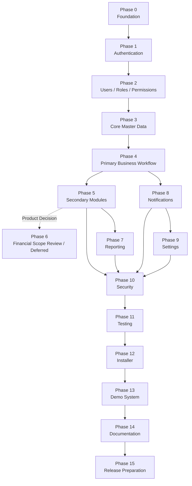

# DEVELOPMENT ROADMAP — LearnFlow LMS

## Document Information

| Field | Value |
|---|---|
| Product | LearnFlow LMS |
| Document | Technical Development Roadmap |
| Version | 1.0 |
| Architecture | Laravel Modular Monolith |
| Target Backend | Laravel 13.x |
| Target PHP | PHP 8.4.x |
| Target Database | MySQL 8.4.x |
| Frontend | Blade + Livewire + Alpine.js + Tailwind CSS |
| Deployment | VPS |
| Product Authority | `docs/PRD.md` |
| Technical References | `docs/SRS.md`, `docs/SYSTEM_DESIGN.md`, `docs/BUSINESS_FLOW.md`, `docs/DATABASE.md`, `docs/UI_UX.md`, `CURSOR.md` |

> This roadmap breaks LearnFlow LMS into controlled implementation phases. Each phase must be completed with its acceptance criteria and testing requirements before dependent phases are considered stable.

---

# Roadmap Principles

Development must follow these principles:

1. build the smallest stable foundation first;
2. follow Laravel conventions;
3. maintain modular monolith boundaries;
4. implement authorization from the beginning;
5. protect academic data integrity;
6. avoid premature SaaS/multi-tenancy complexity;
7. avoid unnecessary packages;
8. prefer Laravel-native functionality;
9. write tests together with business logic;
10. do not silently expand MVP scope;
11. preserve backward compatibility whenever practical;
12. update documentation when architecture or product behavior changes.

Recommended implementation order:

```text
Foundation
→ Authentication
→ Access Control
→ Master Data
→ Core LMS Workflow
→ Supporting LMS Modules
→ Financial Scope Review
→ Reporting
→ Notifications
→ Settings
→ Security Hardening
→ Full Testing
→ Installer
→ Demo System
→ Documentation
→ Release
```

---

# Phase 0 — Project Foundation

## Objectives

Establish a clean, verifiable Laravel project foundation before business features are implemented.

The project must be ready for consistent local development, testing, and future VPS deployment.

## Modules

- Laravel project bootstrap
- PHP/runtime verification
- MySQL connection
- frontend stack initialization
- Blade layout foundation
- Livewire foundation
- Alpine.js initialization
- Tailwind CSS configuration
- environment configuration
- application structure
- base test environment
- coding standards
- Git repository conventions

## Dependencies

None.

This is the first implementation phase.

## Deliverables

- working Laravel application;
- verified actual Laravel version;
- verified PHP version;
- verified MySQL version;
- verified Livewire version;
- verified Alpine.js version;
- verified Tailwind CSS version;
- `.env.example`;
- local database connection;
- base application layout;
- base error pages;
- test database configuration;
- formatter/code-style setup;
- initial CI-ready test command;
- base directory/module conventions;
- project README skeleton.

Update documentation where target and actual versions differ.

## Acceptance Criteria

- application starts successfully;
- database connection succeeds;
- migrations can run on clean database;
- frontend assets compile successfully;
- Blade renders correctly;
- Livewire component can render successfully;
- Alpine.js behavior can execute;
- Tailwind styles load;
- test suite command executes successfully;
- no credentials exist in repository;
- debug configuration is environment-controlled.

## Testing Requirements

Minimum:

- application boot test;
- database connectivity test;
- simple feature test;
- simple Livewire rendering test;
- asset build verification;
- environment configuration review.

---

# Phase 1 — Authentication

## Objectives

Provide secure account authentication and credential recovery.

## Modules

- Login
- Logout
- Forgot Password
- Reset Password
- Session Management
- Account Status Enforcement

## Dependencies

- Phase 0

## Deliverables

- Login page;
- password authentication;
- logout;
- password reset request;
- password reset email flow;
- password reset form;
- active/inactive user enforcement;
- role-aware dashboard redirect placeholder;
- basic authentication audit/security events where required.

## Acceptance Criteria

- active user with valid credentials can login;
- invalid credentials are rejected;
- inactive user cannot login;
- authenticated user receives a valid session;
- logout invalidates session;
- password reset token expires according to configured policy;
- used reset token cannot be reused;
- login failure does not expose sensitive account existence information;
- production responses do not display stack traces.

## Testing Requirements

Automated tests:

- active user login;
- invalid password;
- unknown identifier;
- inactive account;
- logout;
- reset request;
- valid reset;
- expired/invalid token;
- reused reset token;
- guest access to protected route.

---

# Phase 2 — Users / Roles / Permissions

## Objectives

Implement the access-control foundation required by every subsequent LMS module.

## Modules

- Users
- Roles
- Permissions
- Role Assignment
- Permission Assignment
- Policies/Gates Foundation
- User Status Management

## Dependencies

- Phase 0
- Phase 1

## Deliverables

- User CRUD without destructive academic delete;
- user list/search/pagination;
- user detail;
- activate/deactivate user;
- seeded core roles:
  - Administrator;
  - Instructor;
  - Student;
- optional Manager/Viewer if product requires;
- permission catalog;
- role-permission management;
- user-role assignment;
- policy/gate conventions;
- audit records for user/access changes.

## Acceptance Criteria

- Administrator can create a user;
- duplicate email/login identifier is rejected;
- role can be assigned;
- unauthorized user cannot manage users;
- inactive user history remains intact;
- permission changes take effect consistently;
- menu visibility does not replace server-side authorization;
- role and permission changes are auditable.

## Testing Requirements

- User CRUD tests;
- role assignment tests;
- permission assignment tests;
- unauthorized access tests;
- deactivate/reactivate tests;
- policy tests;
- direct URL authorization tests;
- audit event tests.

---

# Phase 3 — Core Master Data

## Objectives

Build the master data and structural entities needed before learning transactions begin.

## Modules

- Institution Profile
- Course Categories
- Courses
- Instructor Assignment
- Enrollment
- File Metadata Foundation

## Dependencies

- Phase 0
- Phase 1
- Phase 2

## Deliverables

### Institution

- institution profile data;
- base branding references;
- timezone;
- locale.

### Course Categories

- create;
- edit;
- activate/deactivate;
- list/search.

### Courses

- create Course;
- draft state;
- publish Course;
- archive Course;
- Course visibility;
- category assignment;
- Course code;
- Course detail.

### Instructor Assignment

- assign Instructor;
- remove Instructor assignment;
- Course-scoped Instructor authorization.

### Enrollment

- enroll Student;
- enrollment states:
  - active;
  - completed;
  - suspended;
  - removed;
- status transition rules;
- enrollment list/filter.

### File Foundation

- validated File metadata;
- private/public visibility foundation.

## Acceptance Criteria

- Admin can create Category and Course;
- Draft Course is invisible to Student;
- Published enrolled-only Course requires active Enrollment;
- one Course can have multiple Instructors;
- duplicate active Student-Course Enrollment is prevented;
- Enrollment status transitions follow Business Flow;
- archived Course preserves historical records;
- all Course/Enrollment access is policy-protected.

## Testing Requirements

- Category CRUD tests;
- Course lifecycle tests;
- draft visibility tests;
- Course authorization tests;
- Instructor assignment tests;
- Enrollment creation tests;
- duplicate Enrollment tests;
- suspension/removal tests;
- archive behavior tests;
- N+1 query review on Course lists.

---

# Phase 4 — Primary Business Workflow

## Objectives

Deliver the complete core LMS learning and assessment workflow.

This is the most important functional phase.

## Modules

- Modules
- Lessons
- Lesson Completion
- Learning Progress
- Assignments
- Submissions
- Quiz
- Quiz Attempts
- Automatic Scoring
- Grades
- Grade Publication

## Dependencies

- Phase 0
- Phase 1
- Phase 2
- Phase 3

## Deliverables

## A. Course Content

- Module CRUD;
- Module ordering;
- Lesson CRUD;
- Lesson types:
  - text;
  - file;
  - URL;
  - embed;
- draft/published Lesson;
- Lesson ordering;
- Lesson completion.

## B. Progress

- completion-enabled Lesson tracking;
- Course progress calculation;
- Student progress display.

## C. Assignment

- Assignment creation;
- draft/publish/close;
- due date;
- maximum score;
- submission mode;
- late submission policy;
- text/file submission;
- authoritative server timestamp;
- late indicator.

## D. Assignment Grading

- Submission review;
- score;
- feedback;
- Grade creation;
- Grade publication;
- Grade audit.

## E. Quiz

- Quiz creation;
- Multiple Choice;
- True/False;
- attempt limit;
- optional duration;
- optional availability window;
- answer key;
- weighted score;
- Quiz Attempt;
- automatic scoring;
- final Gradebook integration.

## Acceptance Criteria

End-to-end scenario must work:

```text
Admin
→ Creates Course
→ Assigns Instructor
→ Enrolls Student

Instructor
→ Creates Module
→ Creates Lesson
→ Publishes Lesson

Student
→ Opens Lesson
→ Completes Lesson
→ Progress Updates

Instructor
→ Creates Assignment
→ Publishes Assignment

Student
→ Submits Assignment

Instructor
→ Grades Submission
→ Publishes Grade

Instructor
→ Creates Quiz
→ Publishes Quiz

Student
→ Attempts Quiz
→ System Scores Attempt

Student
→ Sees Authorized Result
```

Additional criteria:

- Student cannot submit without active Enrollment;
- late state is calculated from server time;
- Assignment score cannot exceed maximum;
- Quiz attempts cannot exceed configured limit;
- Quiz score is deterministic;
- finalized Attempt cannot be finalized twice;
- Student sees only own Grade;
- Grade changes are auditable;
- Progress stays between 0 and 100%.

## Testing Requirements

High-priority automated tests:

- Module/Lesson authorization;
- Draft Lesson visibility;
- Lesson completion;
- progress calculation;
- Assignment availability;
- submission authorization;
- file submission validation;
- late submission;
- score limits;
- Quiz availability;
- Quiz attempt limits;
- Quiz scoring;
- duplicate finalization;
- Grade publication;
- cross-Student Grade access denial;
- transaction rollback tests.

---

# Phase 5 — Secondary Modules

## Objectives

Add communication and operational modules that improve the LMS experience without expanding into enterprise complexity.

## Modules

- Announcements
- Discussions
- Student Course Overview
- Instructor Work Queue
- Gradebook UI Refinement
- Progress Views
- Course Activity Views

## Dependencies

- Phase 4

## Deliverables

### Announcements

- draft;
- publish;
- optional schedule-ready structure;
- Course audience.

### Discussions

- enable/disable per Course;
- thread creation;
- replies;
- open/closed thread state;
- Instructor/Admin moderation.

### Course Operational Views

- Instructor pending grading view;
- Student upcoming activity view;
- Course overview;
- Course progress summary.

## Acceptance Criteria

- eligible Course users can see published Announcements;
- users outside Course scope cannot see private Course communications;
- active Student can create/reply Discussion when enabled;
- closed thread cannot accept new replies;
- Instructor sees pending grading within assigned Courses;
- Student Course views contain only permitted data.

## Testing Requirements

- Announcement visibility;
- Course audience scoping;
- Discussion access;
- closed-thread behavior;
- unauthorized Course access;
- Instructor Course scope;
- empty-state behavior;
- Livewire interaction tests where applicable.

---

# Phase 6 — Financial Modules

## Objectives

Perform a formal scope checkpoint for financial capabilities.

**Important:** Financial modules are explicitly outside the current LearnFlow LMS MVP.

The objective of this phase is therefore **not to implement payment/billing prematurely**.

## Modules

Deferred modules:

- Payments
- Invoices
- Subscription Billing
- Course E-Commerce
- Orders
- Instructor Commission
- SaaS Plans
- Tenant Billing

## Dependencies

- Product strategy decision
- Explicit PRD change
- Commercial validation

## Deliverables

For MVP:

- documented `Not Applicable / Deferred` decision;
- confirmation that no financial tables/routes/services are introduced;
- confirmation that core LMS remains independent of payment state.

If future scope is approved:

- separate Financial/Billing bounded context design;
- new PRD/SRS update before development;
- currency and decimal policy;
- payment state machine;
- reconciliation strategy;
- refund/cancellation rules;
- provider integration design.

## Acceptance Criteria

For current MVP:

- no financial functionality is required for release;
- no payment dependency blocks Course learning;
- no unused payment tables exist;
- no speculative billing package is installed;
- docs consistently mark financial features as future scope.

## Testing Requirements

For current MVP:

- verify no Course learning workflow depends on payment;
- verify no payment routes or configuration are accidentally exposed.

Future billing testing requires a separate approved specification.

---

# Phase 7 — Reporting

## Objectives

Provide authorized operational and academic reporting without introducing a separate data warehouse.

## Modules

- User Report
- Enrollment Report
- Course Activity Report
- Assignment Submission Report
- Grade Report
- Progress Report
- CSV Export

## Dependencies

- Phase 3
- Phase 4
- Phase 5

## Deliverables

- report navigation;
- role-scoped reports;
- filters;
- date ranges where relevant;
- pagination;
- empty states;
- CSV export;
- large-export queue readiness if necessary.

## Acceptance Criteria

- reports respect authorization scope;
- Student cannot access management reports;
- Instructor sees only assigned Course data;
- exported data matches active filters;
- no-data result displays valid empty state;
- Grade report does not expose unpublished data beyond permission;
- archived Course remains reportable.

## Testing Requirements

- report permission tests;
- Course scope tests;
- filter tests;
- CSV export tests;
- no-data tests;
- large dataset query review;
- N+1 review;
- index/query plan review for expensive reports.

---

# Phase 8 — Notifications

## Objectives

Deliver event-based in-app notifications and optional email without coupling notification delivery to critical academic transactions.

## Modules

- In-App Notifications
- Email Notification
- Read/Unread State
- Notification Preferences Foundation
- Queue Integration

## Dependencies

- Phase 1
- Phase 4
- Phase 5

## Deliverables

Supported events should include:

- Assignment published;
- Grade published;
- Announcement published;
- new Submission notification for Instructor if enabled;
- deadline reminder foundation if approved.

UI:

- notification indicator;
- notification dropdown;
- View All page;
- mark read;
- mark all read if desired.

## Acceptance Criteria

- notification recipient is Course/user scoped correctly;
- notification failure does not rollback successful Grade/Submission/etc.;
- read/unread state persists;
- inactive or ineligible users do not receive inappropriate Course notifications;
- non-critical email can run asynchronously.

## Testing Requirements

- recipient resolution;
- read/unread state;
- event dispatch;
- queued email;
- failed email isolation;
- duplicate retry behavior;
- authorization of notification page.

---

# Phase 9 — Settings

## Objectives

Make standard institutional customization possible without editing source code.

## Modules

- Institution Settings
- Branding
- Localization
- Learning Defaults
- Notification Defaults
- File Upload Settings

## Dependencies

- Phase 2
- Phase 3
- Phase 8 where notification settings are included

## Deliverables

Settings groups:

```text
Institution
Branding
Localization
Learning Defaults
Notifications
File Upload
```

Configuration may include:

- institution name;
- logo;
- favicon;
- contact details;
- timezone;
- locale;
- Course code uniqueness;
- default quiz attempt limit;
- file limits;
- supported notification toggles.

## Acceptance Criteria

- authorized Admin can update settings;
- non-Admin cannot update system settings;
- branding changes appear consistently;
- timezone is used consistently for academic timestamps display;
- secrets are not stored in normal institution settings;
- settings cache invalidates correctly if caching is used.

## Testing Requirements

- settings authorization;
- validation;
- branding upload validation;
- timezone behavior;
- locale behavior;
- cache invalidation;
- invalid settings input.

---

# Phase 10 — Security

## Objectives

Perform focused security hardening before release.

Security must already exist in earlier phases; this phase validates and strengthens it.

## Modules

- Authentication Hardening
- Authorization Review
- Upload Security
- Session Security
- CSRF Review
- Rate Limiting
- Output Escaping
- Audit Review
- Environment Security
- Production Security Configuration

## Dependencies

- Phases 1–9

## Deliverables

- security checklist;
- route authorization review;
- policy coverage review;
- private file access review;
- user-generated content escaping review;
- rich-text sanitization strategy if needed;
- rate limiting for authentication/reset;
- production HTTPS requirement;
- secure session configuration;
- credential/secrets audit;
- permission escalation review.

## Acceptance Criteria

No known critical authorization path permits:

- Student viewing another Student Grade;
- Student viewing another Student Submission;
- Instructor modifying another Instructor's Course without permission;
- guest accessing protected Course data;
- unauthorized access to private files;
- user changing own role via client manipulation.

No production page exposes:

- stack trace;
- `.env`;
- credentials;
- application keys;
- password hashes.

## Testing Requirements

Security-focused tests:

- guest access;
- role escalation attempt;
- cross-Course access;
- cross-Student access;
- ID enumeration;
- CSRF;
- password reset abuse;
- invalid upload;
- executable upload attempt;
- private file direct URL access;
- rate-limit behavior where configured.

---

# Phase 11 — Testing

## Objectives

Consolidate product-wide test coverage and prepare the application for UAT.

## Modules

- Unit Tests
- Feature Tests
- Livewire Tests
- Integration Tests
- Regression Tests
- UAT
- Performance Baseline
- Accessibility Review

## Dependencies

- Phases 0–10

## Deliverables

- complete test suite;
- critical journey test matrix;
- factories;
- seeders;
- deterministic test fixtures;
- regression coverage for known bugs;
- UAT checklist;
- defect log;
- performance baseline.

Critical personas:

```text
Administrator
Instructor A
Instructor B
Student A
Student B
```

## Acceptance Criteria

All PRD MVP acceptance criteria pass.

Critical end-to-end journeys pass:

1. Admin creates user/course/enrollment.
2. Instructor creates learning content.
3. Student completes Lesson.
4. Student submits Assignment.
5. Instructor grades.
6. Instructor creates Quiz.
7. Student completes Quiz.
8. Student sees valid Grade/progress.
9. Admin/Instructor generates report.
10. unauthorized cross-user/Course requests are denied.

No blocker/critical defect remains open.

## Testing Requirements

Required:

- full automated test run;
- fresh database migration test;
- regression test run;
- authorization matrix testing;
- browser smoke test;
- responsive UI review;
- accessibility keyboard review;
- performance test with representative dataset;
- file upload/download tests.

---

# Phase 12 — Installer

## Objectives

Make LearnFlow installable repeatedly as a commercial self-hosted source-code product.

## Modules

- Installation Prerequisite Check
- Environment Setup Guidance
- Database Setup
- Application Initialization
- Admin Account Creation
- Institution Setup
- Initial Seeding
- Installation Lock

## Dependencies

- Stable database schema
- Stable configuration
- Phase 11 core tests passing

## Deliverables

Recommended installer workflow:

```text
Welcome
→ Requirements Check
→ Environment Configuration
→ Database Check
→ Run Migrations
→ Create Administrator
→ Institution Setup
→ Finalize
→ Lock Installer
```

The exact implementation should remain Laravel-native where possible.

## Acceptance Criteria

- fresh supported VPS/environment can install LearnFlow using documented procedure;
- installer validates required PHP/extensions/configuration;
- database errors are clearly reported;
- Admin account can be created;
- institution profile can be initialized;
- installer cannot be rerun accidentally after successful installation;
- installation does not expose credentials;
- migration failure does not report false success.

## Testing Requirements

- clean installation;
- invalid DB credentials;
- unavailable database;
- missing requirement;
- duplicate installation attempt;
- partial-install recovery;
- secure installer lock;
- fresh production boot after install.

---

# Phase 13 — Demo System

## Objectives

Create a safe, realistic product demo for sales and evaluation.

## Modules

- Demo Seed Data
- Demo Accounts
- Demo Restrictions
- Demo Reset
- Demo Banner/Notice

## Dependencies

- Phase 11
- Phase 12 where installer/package behavior affects demo packaging

## Deliverables

Demo roles:

- Administrator Demo
- Instructor Demo
- Student Demo

Demo data:

- fictional institution;
- users;
- Courses;
- Modules;
- Lessons;
- Assignments;
- Submissions;
- Quizzes;
- Grades;
- Progress;
- Announcements;
- Discussions.

Demo safety:

- block destructive shared-demo actions;
- protect critical credentials;
- prevent unsafe file behavior;
- provide periodic data reset capability if public demo is hosted.

## Acceptance Criteria

- each demo role can demonstrate its main workflow;
- demo restrictions are clearly communicated;
- blocked actions do not report fake success;
- production mode is unaffected by demo restrictions;
- demo credentials/data are fictional;
- demo can be reset to known state.

## Testing Requirements

- demo role login;
- demo workflow smoke tests;
- restricted action tests;
- reset test;
- separation between demo mode and production mode.

---

# Phase 14 — Documentation

## Objectives

Prepare complete technical and user documentation for repeatable development, deployment, operation, and customer use.

## Modules

### Product / Engineering Documentation

Existing:

- `docs/PRD.md`
- `docs/SRS.md`
- `docs/SYSTEM_DESIGN.md`
- `docs/BUSINESS_FLOW.md`
- `docs/DATABASE.md`
- `docs/UI_UX.md`
- `docs/ROADMAP.md`
- `CURSOR.md`

Additional release documentation:

- README
- Installation Guide
- Deployment Guide
- Environment Configuration
- Upgrade Guide
- Backup & Restore Guide
- Troubleshooting Guide
- User Guide
- Release Notes
- Changelog

## Dependencies

- All functional behavior largely stable
- Installer stable
- Demo stable

## Deliverables

### Developer Documentation

- project setup;
- architecture overview;
- module boundaries;
- environment configuration;
- queue;
- scheduler;
- files;
- testing;
- deployment.

### Administrator Documentation

- institution setup;
- users;
- roles;
- Courses;
- Enrollment;
- reports;
- audit.

### Instructor Documentation

- Course content;
- Assignment;
- Quiz;
- Grade;
- announcement;
- discussion.

### Student Documentation

- Course access;
- Lesson;
- Assignment submission;
- Quiz;
- Grade;
- Progress.

## Acceptance Criteria

- fresh developer can set up local project using docs;
- fresh administrator can install/configure product;
- each primary role has documented workflow;
- documented environment variables match actual project;
- no documentation contains production credentials;
- screenshots/examples use fictional data;
- architecture docs match released implementation.

## Testing Requirements

Documentation validation:

- follow installation documentation from clean environment;
- execute documented test command;
- verify deployment steps;
- verify backup/restore instructions;
- check links/file references;
- review examples for outdated behavior.

---

# Phase 15 — Release Preparation

## Objectives

Prepare LearnFlow LMS v1.0 for commercial or controlled production distribution.

## Modules

- Release Audit
- Build/Packaging
- Versioning
- Release Notes
- Upgrade Safety
- Backup Verification
- Production Configuration
- Demo Verification
- License/Distribution Preparation
- Final UAT

## Dependencies

- Phases 0–14 complete
- MVP acceptance criteria pass

## Deliverables

- release candidate;
- version number;
- changelog;
- release notes;
- production environment checklist;
- clean install package;
- upgrade instructions where applicable;
- backup/restore verification;
- demo package/environment;
- known limitations list;
- security review summary;
- final database migration set;
- artifact integrity checks.

## Acceptance Criteria

### Functional

- MVP business workflows pass;
- all three primary roles function correctly;
- reporting works;
- notifications work;
- settings work;
- demo works.

### Technical

- fresh install succeeds;
- migrations succeed;
- no known production migration has been modified improperly;
- test suite passes;
- queue/scheduler behavior verified;
- private files protected;
- debug disabled;
- production secrets externalized.

### Product

- PRD acceptance criteria fulfilled;
- out-of-scope features remain out of release;
- no unresolved blocker defects;
- release documentation is complete;
- known limitations are documented.

## Testing Requirements

Final release test:

```text
Fresh Install
→ Administrator Setup
→ User Creation
→ Course Creation
→ Enrollment
→ Lesson Creation
→ Assignment
→ Submission
→ Grading
→ Quiz
→ Automatic Score
→ Grade Publication
→ Progress
→ Announcement
→ Discussion
→ Reporting
→ Notifications
→ Course Completion / Archive
```

Also required:

- full automated suite;
- clean migration test;
- security regression test;
- browser smoke test;
- responsive test;
- demo test;
- backup test;
- restore test;
- production configuration review.

---

# Phase Dependency Map



---

# MVP Scope by Phase

| Phase | MVP Requirement |
|---|---|
| 0 — Foundation | Required |
| 1 — Authentication | Required |
| 2 — Users/Roles/Permissions | Required |
| 3 — Core Master Data | Required |
| 4 — Primary Business Workflow | Required |
| 5 — Secondary Modules | Required |
| 6 — Financial Modules | **Deferred / Not in MVP** |
| 7 — Reporting | Required |
| 8 — Notifications | Required |
| 9 — Settings | Required |
| 10 — Security | Required |
| 11 — Testing | Required |
| 12 — Installer | Required for commercial source-code release |
| 13 — Demo System | Strongly recommended for commercial release |
| 14 — Documentation | Required |
| 15 — Release Preparation | Required |

---

# Recommended Release Milestones

## Milestone A — Technical Foundation

Completion:

```text
Phase 0–2
```

Outcome:

```text
Secure Laravel application
+
Users
+
Roles
+
Permissions
```

---

## Milestone B — LMS Foundation

Completion:

```text
Phase 3
```

Outcome:

```text
Courses
+
Instructors
+
Enrollments
+
Institution Data
```

---

## Milestone C — Functional LMS Alpha

Completion:

```text
Phase 4
```

Outcome:

```text
Course Content
+
Assignments
+
Submissions
+
Quizzes
+
Grades
+
Progress
```

This is the first technically meaningful LMS release.

---

## Milestone D — Product Beta

Completion:

```text
Phase 5
+
Phase 7
+
Phase 8
+
Phase 9
```

Outcome:

```text
Complete LMS workflow
+
Communication
+
Reporting
+
Notifications
+
Settings
```

---

## Milestone E — Release Candidate

Completion:

```text
Phase 10
+
Phase 11
+
Phase 12
+
Phase 13
+
Phase 14
```

Outcome:

```text
Hardened
Tested
Installable
Demo-ready
Documented
```

---

## Milestone F — LearnFlow LMS v1.0

Completion:

```text
Phase 15
```

Release goal:

> A stable, secure, installable, documented LearnFlow LMS that supports the complete asynchronous learning workflow for Administrator, Instructor, and Student without requiring payment, marketplace, SaaS tenancy, AI, or enterprise integrations.

---

# Definition of Phase Completion

A phase is not considered complete merely because its screens exist.

A phase is complete only when:

```text
Requirement implemented
+
Validation implemented
+
Authorization implemented
+
Error states handled
+
Loading states handled where relevant
+
Audit behavior implemented where required
+
Tests pass
+
No critical N+1 issue
+
Documentation updated where required
```

---

# Final Development Sequence

```text
PHASE 0
Project Foundation
        ↓
PHASE 1
Authentication
        ↓
PHASE 2
Users / Roles / Permissions
        ↓
PHASE 3
Core Master Data
        ↓
PHASE 4
Primary LMS Workflow
        ↓
PHASE 5
Secondary LMS Modules
        ↓
PHASE 7–9
Reports + Notifications + Settings
        ↓
PHASE 10
Security Hardening
        ↓
PHASE 11
Full Testing / UAT
        ↓
PHASE 12
Installer
        ↓
PHASE 13
Demo System
        ↓
PHASE 14
Documentation
        ↓
PHASE 15
Release Preparation
        ↓
LearnFlow LMS v1.0
```

**Phase 6 Financial Modules remains deliberately deferred until a future product requirement explicitly introduces billing, payment, e-commerce, subscription, or SaaS monetization functionality.**
