# SYSTEM DESIGN — LearnFlow LMS

## Document Information

| Field | Value |
|---|---|
| Product | LearnFlow LMS |
| Document | System Design |
| Version | 1.0 |
| Architecture Style | Modular Monolith |
| Product Authority | `docs/PRD.md` |
| Technical Authority | `docs/SRS.md` |
| Deployment Target | VPS |
| Requested Stack | Laravel 13.x, PHP 8.4.x, MySQL 8.4.x, Blade, Livewire, Alpine.js, Tailwind CSS |
| Verified Runtime Versions | **TBD — Requires Environment Verification** |

> `docs/PRD.md` is the authoritative product requirement. `docs/SRS.md` translates the PRD into technical requirements. This document defines architecture without changing product scope.

---

# 1. Architecture Overview

LearnFlow LMS will initially use a **Laravel modular monolith** architecture.

The application is deployed as one Laravel application, one primary relational database, and a small set of supporting runtime processes such as queue workers and the Laravel scheduler.

Primary principles:

1. Laravel-native functionality first.
2. One deployable application for MVP.
3. Logical module boundaries without premature package extraction.
4. Business logic outside views and thin controllers/components.
5. Server-side authentication and authorization.
6. MySQL as the persistent source of truth.
7. Queue for non-critical asynchronous work.
8. Cache only as an optimization.
9. Private-by-default protected academic files.
10. Evolution toward SaaS must remain possible without implementing multi-tenancy in MVP.

High-level architecture:

```text
Browser
   |
 HTTPS
   |
   v
Laravel Application
   |
   +-- Presentation
   |    +-- Routes
   |    +-- Middleware
   |    +-- Controllers
   |    +-- Livewire Components
   |    +-- Blade Views
   |
   +-- Application
   |    +-- Actions
   |    +-- Services
   |    +-- Transactions
   |
   +-- Domain
   |    +-- Models
   |    +-- Policies
   |    +-- Business Rules
   |
   +-- Infrastructure
        +-- MySQL
        +-- Filesystem
        +-- Queue
        +-- Cache
        +-- Mail
        +-- Notifications
        +-- Logging
```

---

# 2. System Context Diagram using Mermaid

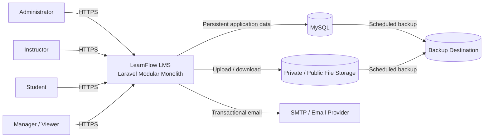

System boundary includes:

- identity and access;
- LMS business workflows;
- academic content;
- assessments;
- grades;
- progress;
- communications;
- reporting;
- audit history.

External systems do not become the authoritative source for enrollment, submission, grade, or progress in MVP.

---

# 3. Application Architecture

## 3.1 Layer Model

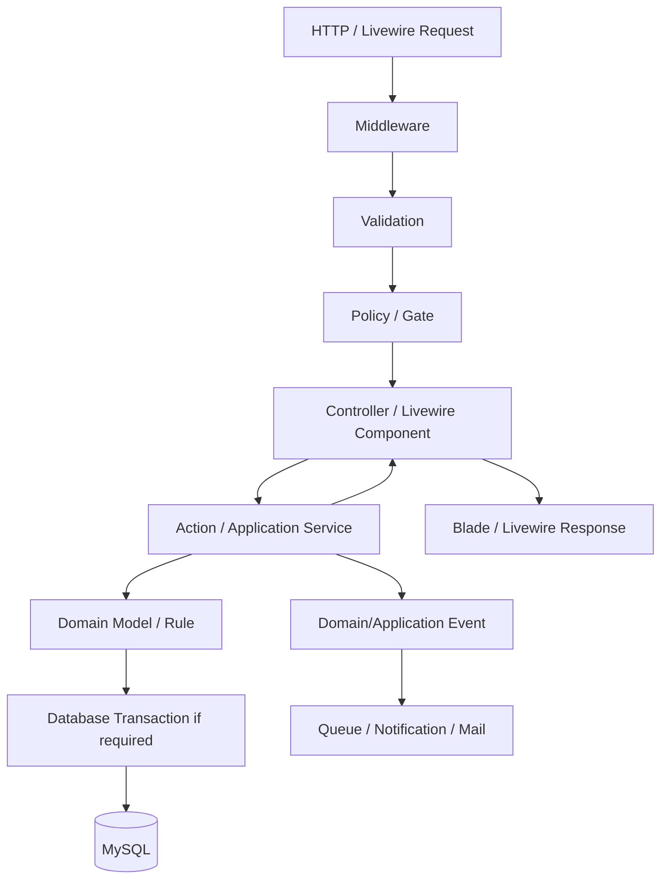

## 3.2 Presentation Layer

Responsibilities:

- route handling;
- UI state;
- validation feedback;
- invoking application actions;
- rendering;
- pagination/search/filter input.

Must not own:

- quiz scoring;
- grade rules;
- enrollment eligibility;
- transactional academic state;
- authorization logic duplicated from policies.

## 3.3 Application Layer

Coordinates use cases such as:

- create user;
- deactivate user;
- create course;
- publish course;
- assign instructor;
- enroll student;
- suspend enrollment;
- create/publish lesson;
- submit assignment;
- grade submission;
- start/finalize quiz;
- publish grade;
- mark lesson completion;
- publish announcement;
- generate report/export.

## 3.4 Domain Layer

Owns core rules for:

- course lifecycle;
- enrollment state;
- lesson visibility;
- assignment due date;
- quiz attempts;
- grading;
- course progress;
- discussion status.

## 3.5 Infrastructure Layer

Uses Laravel conventions for:

- Eloquent persistence;
- filesystem;
- cache;
- queue;
- mail;
- notifications;
- scheduler;
- logs.

---

# 4. Module Architecture

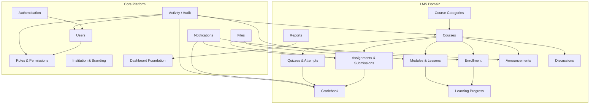

Logical modules do not need to become independent Composer packages in MVP.

---

# 5. Domain Boundaries

## 5.1 Identity & Access

Owns:

- users;
- account status;
- roles;
- permissions;
- login identity.

Does not own enrollment or academic records.

## 5.2 Institution

Owns:

- institution profile;
- branding;
- locale defaults;
- timezone defaults;
- general settings.

## 5.3 Course

Owns:

- course metadata;
- course category;
- draft/published/archived state;
- visibility;
- instructor assignment.

## 5.4 Enrollment

Owns learner-to-course participation.

Valid states:

```text
active
completed
suspended
removed
```

## 5.5 Learning Content

Owns:

- modules;
- lessons;
- ordering;
- lesson publication;
- resources;
- lesson completion settings.

## 5.6 Assignment

Owns:

- assignments;
- deadlines;
- maximum score;
- submissions;
- late status;
- instructor feedback.

## 5.7 Quiz

Owns:

- quiz;
- question;
- answer option;
- availability;
- attempt limits;
- attempts;
- automatic scoring.

## 5.8 Grade

Owns:

- academic scores;
- publication visibility;
- gradebook aggregation.

## 5.9 Progress

Owns lesson completion records and course progress.

MVP formula:

```text
Progress (%) =
Completed Completion-Enabled Lessons
------------------------------------  × 100
Total Completion-Enabled Lessons
```

## 5.10 Communication

Owns:

- announcements;
- discussions;
- replies;
- notification records.

## 5.11 Reporting

Read-oriented domain. It does not mutate academic source-of-truth data.

## 5.12 Audit

Owns append-only records of critical administrative and academic changes.

---

# 6. Data Flow

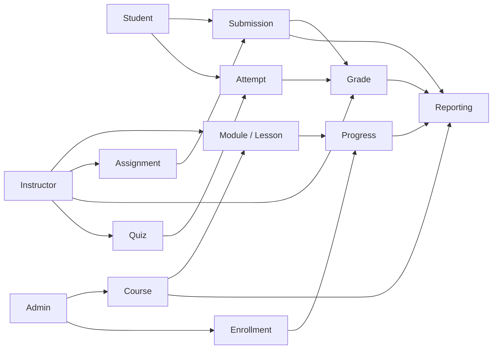

Data rules:

- each domain writes its owned operational data;
- reports read operational data;
- audit records significant changes;
- notification references events but is not the event source;
- queue never becomes academic source of truth.

---

# 7. Request Lifecycle

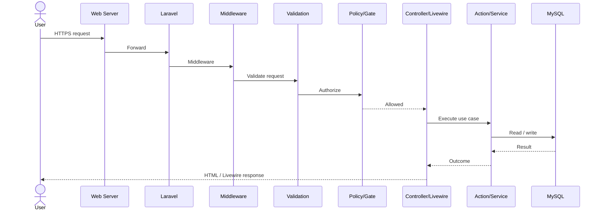

Lifecycle rule:

```text
Authenticate
→ Validate
→ Authorize
→ Execute business operation
→ Persist atomically if needed
→ Dispatch non-critical side effects
→ Return safe response
```

---

# 8. Authentication Flow

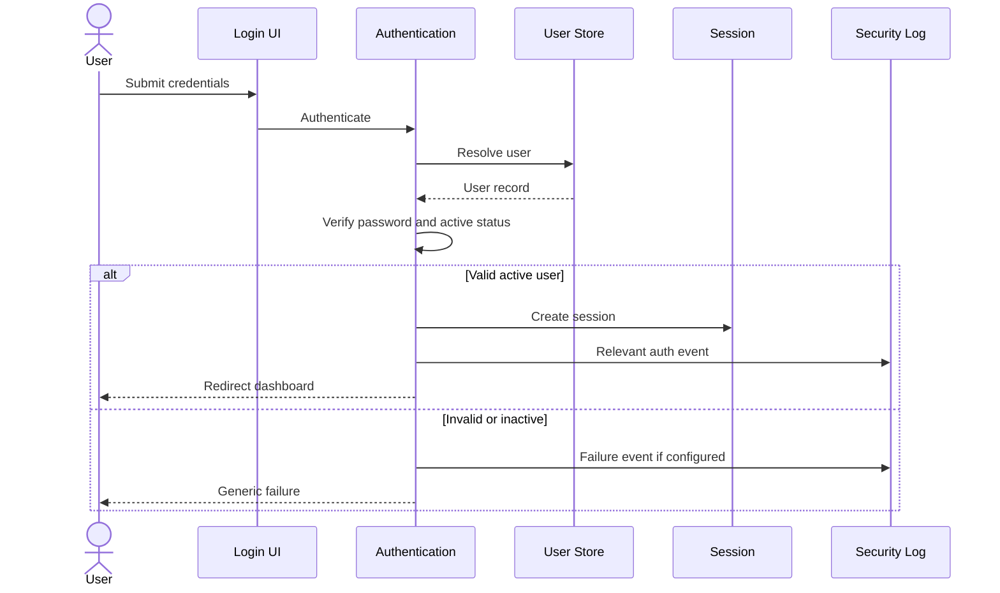

Password reset:

```text
Request reset
→ issue time-limited token
→ email link
→ verify token
→ set new password
→ invalidate token
```

MFA, SSO, OAuth, and social login are future capabilities.

---

# 9. Authorization Flow

Authorization is evaluated from:

```text
Capability
+
Resource scope
+
Relationship
+
Current resource state
```

Example Instructor flow:

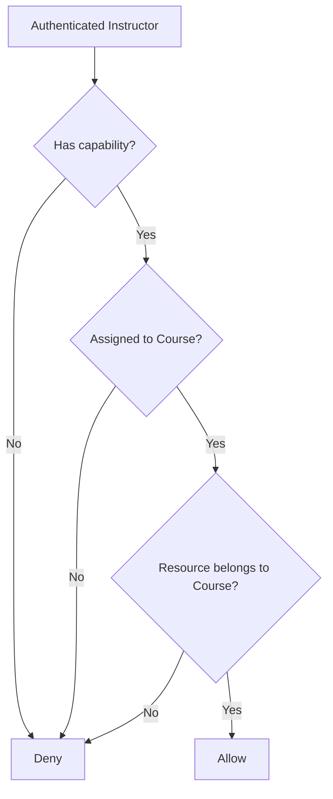

Example Student access:

```text
Authenticated
→ Course published
→ Visibility check
→ Active enrollment if enrolled-only
→ Activity published/available
→ Allow
```

Authorization must be enforced server-side even if the UI hides inaccessible controls.

---

# 10. Business Logic Flow

General pattern:

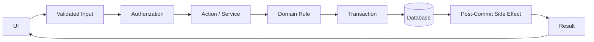

Example assignment submission:

```text
Validate
→ authorize Student + active enrollment
→ verify assignment availability
→ validate submission content/file
→ determine late status
→ transaction:
   save submission
   save approved file relation
   set submitted_at
→ commit
→ optional Instructor notification
```

Example quiz finalization:

```text
Validate active attempt
→ verify ownership
→ prevent duplicate finalization
→ save answers
→ calculate deterministic score
→ transaction:
   finalize attempt
   save submitted_at
   save score/grade
→ commit
```

---

# 11. Notification Flow

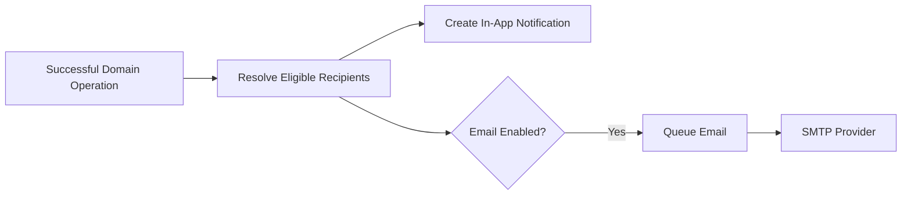

Minimum events:

- assignment published;
- grade published;
- announcement published;
- new submission for Instructor if enabled;
- deadline reminders if enabled.

Non-critical notification failure must not roll back a valid academic transaction.

---

# 12. File Storage Flow

Upload:

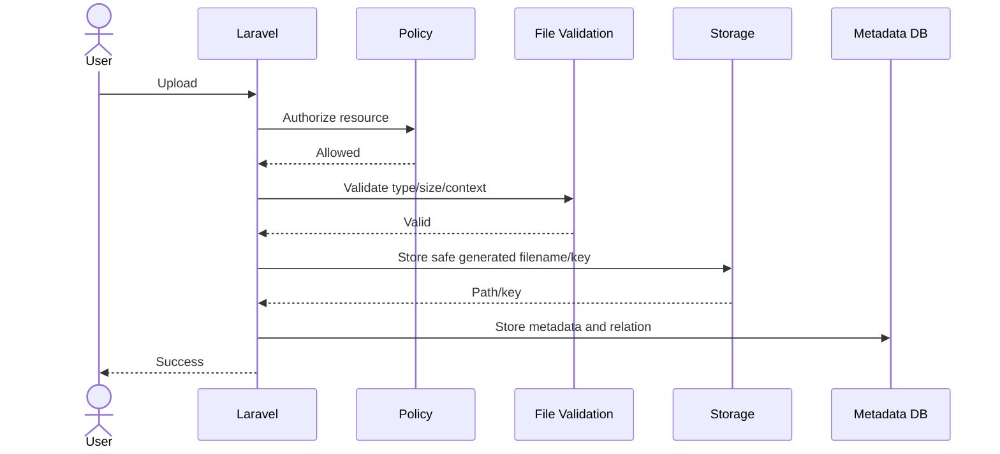

Download:

```text
Request file
→ authenticate
→ load metadata
→ authorize related resource
→ stream file / protected temporary access
```

Protected academic files use private storage by default.

Future S3-compatible storage must preserve the same authorization behavior.

---

# 13. Reporting Flow

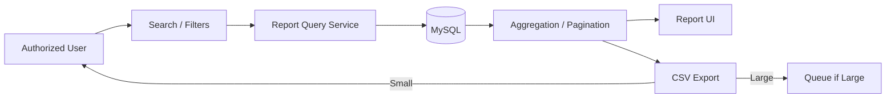

MVP reports:

1. User Report
2. Enrollment Report
3. Course Activity Report
4. Assignment Submission Report
5. Grade Report
6. Progress Report

No separate data warehouse is required for MVP.

---

# 14. Background Job Flow

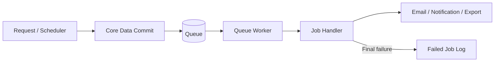

Candidate jobs:

- email;
- bulk notifications;
- large import;
- large export;
- reminders;
- cleanup.

Jobs should be retry-safe and idempotent where duplicate execution can cause harm.

---

# 15. Scheduled Task Architecture

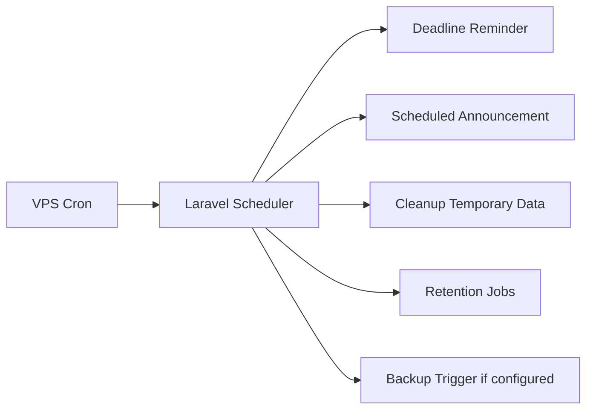

Rules:

- use one Laravel scheduler entry on VPS;
- scheduled tasks are idempotent where feasible;
- scheduler uses configured timezone;
- heavy work may dispatch queue jobs.

---

# 16. Integration Architecture

MVP integration surface:

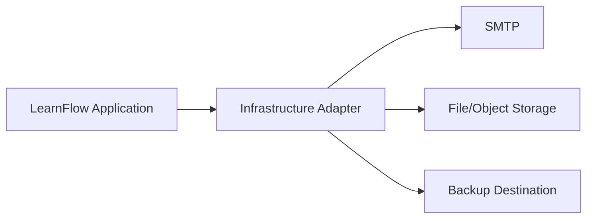

Future integrations:

- REST API;
- webhooks;
- Google/Microsoft login;
- SSO;
- Zoom/meeting provider;
- SCORM;
- xAPI;
- LTI.

Provider-specific SDK calls should not be spread across UI/domain code.

---

# 17. Database Architecture

Requested database: **MySQL 8.4.x**  
Verified actual version: **TBD — Requires Environment Verification**

Logical entity model:

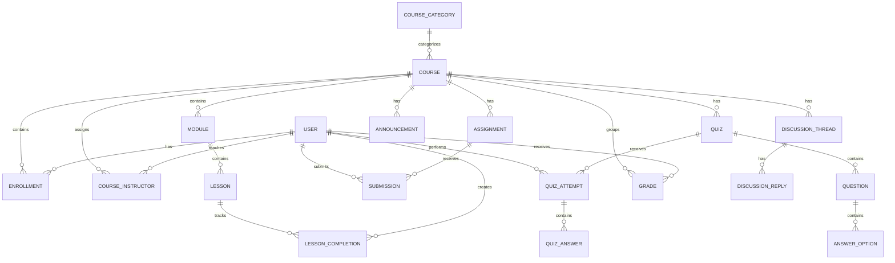

Database rules:

- migrations version schema;
- foreign keys where appropriate;
- uniqueness where required;
- timestamps server authoritative;
- historical academic data should normally be archived/retained rather than hard-deleted;
- indexes follow common lookup/filter paths.

---

# 18. Cache Architecture

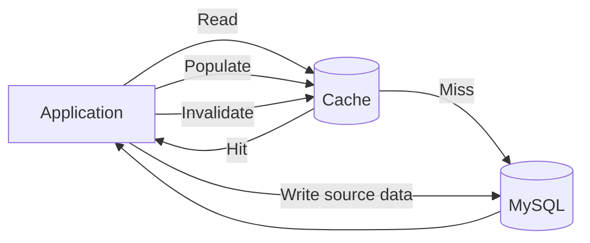

Suitable cache candidates:

- institution settings;
- branding;
- permission lookup;
- reference data;
- expensive dashboard aggregate if proven necessary.

Do not rely on stale cache for:

- enrollment authorization;
- quiz attempt eligibility;
- current grade visibility;
- successful submission state.

Actual cache backend: **TBD — Requires Environment Verification**.

Redis is not mandatory for MVP.

---

# 19. Queue Architecture

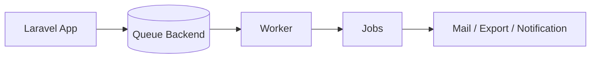

Queue backend: **TBD — Requires Environment Verification**.

MVP should function with one worker.

Future horizontal workers may be added without changing business logic.

---

# 20. Logging Architecture

Logging categories:

```text
Application Logs
├── Errors / Exceptions
├── Queue Failures
├── Scheduled Job Failures
├── Import / Export Failures
├── Integration Failures
└── Operational Diagnostics

Audit Logs
├── User Changes
├── Role / Permission Changes
├── Course Changes
├── Enrollment Changes
└── Grade Changes
```

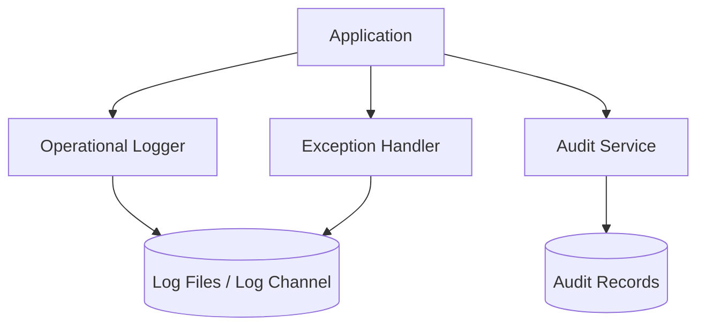

Operational logging and immutable business audit logging are separate concerns.

Logs must not contain:

- plaintext passwords;
- reset tokens;
- database secrets;
- SMTP secrets;
- application secret keys.

---

# 21. Error Handling Architecture

Error categories:

- validation error;
- unauthenticated;
- unauthorized;
- not found;
- business-rule violation;
- conflict/duplicate operation;
- upload failure;
- integration failure;
- unexpected exception.

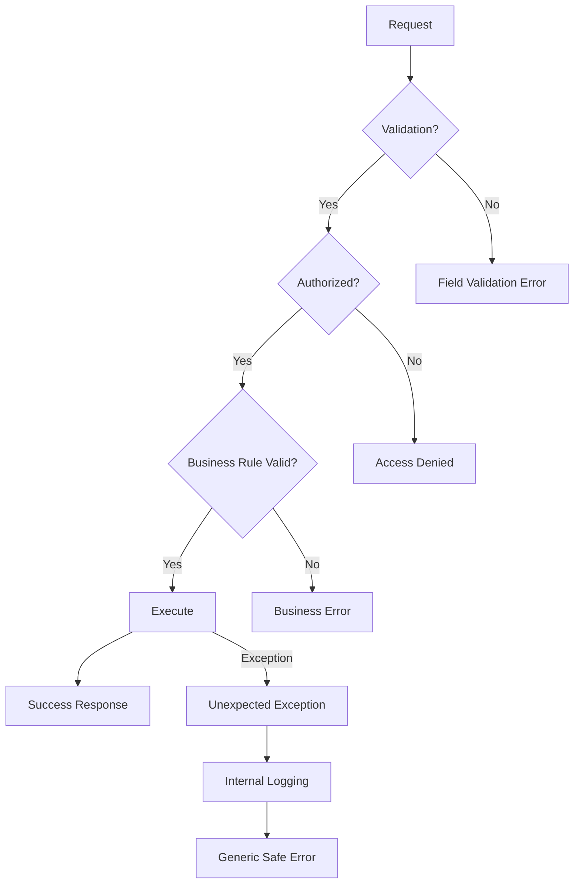

Rules:

- production does not expose stack traces;
- failed academic write must not appear successful;
- errors preserve valid user input where reasonable;
- rollback is used for atomic operations.

---

# 22. Backup Architecture

Backup scope:

- MySQL;
- private uploaded files;
- public branding assets where required;
- deployment configuration needed for restoration, stored securely.

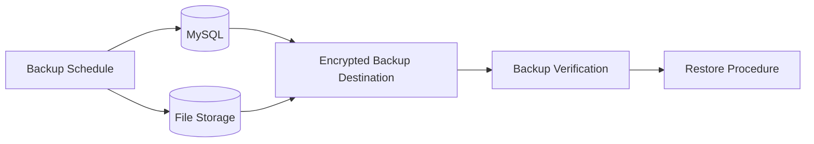

Requirements:

- backup policy documented before production;
- database and files must have compatible restore strategy;
- restore must be tested;
- exact tool and schedule are deployment decisions;
- backup success must be verifiable.

---

# 23. Security Boundaries

## 23.1 Trust Boundaries

```mermaid
flowchart LR
    Internet[Untrusted Internet]
    HTTPS[HTTPS Boundary]
    App[Laravel Application]
    Auth[Auth / Authorization Boundary]
    DB[(Database)]
    Private[(Private Storage)]
    External[External Email / Storage Provider]

    Internet --> HTTPS --> App
    App --> Auth
    Auth --> DB
    Auth --> Private
    App --> External
```

## 23.2 Boundary Rules

### Internet → Application

Must enforce:

- HTTPS;
- request validation;
- CSRF protection;
- authentication;
- rate limits where appropriate.

### Application → Database

Must enforce:

- parameterized framework access;
- least-privileged DB account;
- business invariants;
- transactions where necessary.

### Application → Private Storage

Must enforce:

- file validation;
- controlled filenames/keys;
- resource authorization before download.

### Application → External Providers

Must enforce:

- secrets from environment;
- provider failures isolated from core academic transactions where non-critical;
- no sensitive log leakage.

## 23.3 Sensitive Academic Boundaries

Student A must never read:

- Student B grades;
- Student B submissions;
- unauthorized course files;
- admin audit logs.

Instructor must not manage resources outside assigned Course unless explicitly permitted.

---

# 24. Deployment Architecture

Target: VPS.

Actual:

- OS: **TBD**
- web server/reverse proxy: **TBD**
- PHP runtime: **TBD**
- process manager: **TBD**
- MySQL topology: **TBD**
- queue backend: **TBD**
- cache backend: **TBD**

Recommended logical topology:

```mermaid
flowchart TB
    User[Browser]
    TLS[HTTPS / Reverse Proxy]
    Web[Laravel Web Runtime]
    Worker[Queue Worker]
    Scheduler[Laravel Scheduler]
    DB[(MySQL)]
    Files[(Local / Object Storage)]
    Mail[SMTP]
    Backup[(Backup Destination)]

    User --> TLS --> Web
    Web --> DB
    Web --> Files
    Web --> Mail
    Web --> Worker
    Scheduler --> Web
    DB --> Backup
    Files --> Backup
```

Production requirements:

- HTTPS;
- debug disabled;
- secrets outside repository;
- queue process monitored;
- scheduler configured;
- database migrations controlled;
- storage permissions restricted;
- backup enabled;
- rollback/restore procedure documented.

---

# 25. Scalability Strategy

## Phase 1 — Vertical Simplicity

Initial deployment:

```text
1 VPS
├── Web Runtime
├── Queue Worker
├── Scheduler
├── MySQL
└── Local File Storage
```

Suitable for early deployments where workload remains moderate.

## Phase 2 — Separate Heavy Components

If measured demand requires:

```text
Web VPS
├── Laravel
├── Queue Workers
└── Scheduler

Database
└── MySQL separate/managed

Object Storage
└── S3-compatible
```

## Phase 3 — Horizontal Web/Worker Scaling

Future:

```text
Load Balancer
├── Web Node 1
├── Web Node 2
└── Web Node N

Shared:
├── MySQL
├── Shared Cache if required
├── Shared Queue
└── Object Storage
```

Rules:

- scale only based on measured bottlenecks;
- optimize database/index/query before adding unnecessary systems;
- do not introduce Kubernetes, sharding, service mesh, or event streaming for MVP.

---

# 26. Future SaaS / Multi-Tenant Considerations

Multi-tenancy is **not** an MVP feature.

However, future evolution should consider an explicit tenant boundary.

Potential model:

```mermaid
flowchart TB
    Platform[LearnFlow SaaS Platform]

    Platform --> TenantA[Institution A]
    Platform --> TenantB[Institution B]
    Platform --> TenantC[Institution C]

    TenantA --> UsersA[Users / Courses / Data]
    TenantB --> UsersB[Users / Courses / Data]
    TenantC --> UsersC[Users / Courses / Data]
```

Future decisions required:

1. tenant identification;
2. database isolation strategy;
3. tenant-scoped user identity;
4. custom domains;
5. tenant branding;
6. plans and quotas;
7. subscription/billing;
8. tenant provisioning;
9. tenant-aware queue jobs;
10. tenant-aware cache;
11. tenant-aware file paths;
12. tenant-aware audit;
13. tenant backup/export;
14. tenant deletion/retention.

### Critical rule

Do not add `tenant_id` everywhere in MVP merely as speculative abstraction unless the SaaS design has been formally approved.

Instead, avoid architectural decisions that make future tenant scoping impossible.

---

# 27. Architecture Decisions

## ADR-001 — Modular Monolith

**Decision:** Use modular monolith.

**Reason:**

- simpler deployment;
- lower operational cost;
- easier debugging;
- suitable for Laravel;
- supports commercial source-code distribution;
- product boundaries can still be maintained.

**Rejected:** microservices for MVP.

---

## ADR-002 — Laravel-Native First

**Decision:** Prefer Laravel built-in/conventional capabilities.

**Reason:**

- lower dependency risk;
- easier upgrades;
- better developer familiarity;
- easier customer deployment.

---

## ADR-003 — Blade + Livewire Server-Driven UI

**Decision:** Use requested Blade + Livewire architecture when actual project dependencies are verified.

**Reason:**

- fits CRUD-heavy LMS workflows;
- avoids separate SPA/API complexity;
- keeps one Laravel codebase;
- suitable for source-code product.

---

## ADR-004 — Eloquent without Mandatory Repository Layer

**Decision:** Direct Eloquent data access through application/service boundaries is acceptable.

**Reason:**

- avoids ceremony;
- Laravel-native;
- repositories added only when abstraction has measurable value.

---

## ADR-005 — One Relational Database for MVP

**Decision:** Use one MySQL database.

**Reason:**

- academic records are relational;
- transactions matter;
- reporting benefits from relational queries;
- operational simplicity.

---

## ADR-006 — Private Storage for Protected Files

**Decision:** submissions and restricted resources are private-by-default.

**Reason:** access depends on user, course, and enrollment state.

---

## ADR-007 — Queue for Non-Critical Side Effects

**Decision:** email/bulk tasks may run asynchronously.

**Reason:** user response should not depend on slow external services.

---

## ADR-008 — Database Search Before Dedicated Search Engine

**Decision:** use MySQL search/filter for MVP.

**Reason:** search scope is structured and modest; additional infrastructure is unjustified initially.

---

## ADR-009 — No Public API in MVP

**Decision:** public REST API is future scope.

**Reason:** PRD prioritizes web LMS workflow and simple maintainable MVP.

---

## ADR-010 — SaaS Readiness without Premature Multi-Tenancy

**Decision:** preserve logical boundaries but do not implement tenant infrastructure in MVP.

---

# 28. Architecture Trade-Offs

| Decision | Benefit | Trade-Off | Accepted? |
|---|---|---|---|
| Modular monolith | Simple development/deployment | Modules share runtime/database | Yes |
| One MySQL DB | Transactions and easy reporting | Database can become shared bottleneck at very large scale | Yes |
| Blade + Livewire | Single-stack productivity | Less frontend independence than SPA | Yes |
| Eloquent-first | Fast and Laravel-native | Tight Laravel persistence coupling | Yes |
| No mandatory repository | Less boilerplate | Persistence abstractions are thinner | Yes |
| Database search | Simple infrastructure | Not ideal for very advanced full-text search | Yes |
| Local/private storage initially | Easy VPS setup | Local disk complicates horizontal scaling later | Yes, with object-storage migration path |
| Queue for side effects | Responsive UX | Requires worker operations | Yes |
| No multi-tenancy MVP | Lower complexity | SaaS requires later architecture work | Yes |
| No microservices | Low operational burden | Less independent module deployment | Yes |
| No public API MVP | Faster product delivery | Integrations wait for later phase | Yes |

---

# Final Architecture Summary

LearnFlow LMS should begin as:

```text
Laravel Modular Monolith
        |
        +-- Core Platform
        |    +-- Auth
        |    +-- Users
        |    +-- Roles / Permissions
        |    +-- Institution Settings
        |    +-- Files
        |    +-- Notifications
        |    +-- Audit
        |
        +-- LMS Domain
             +-- Courses
             +-- Enrollment
             +-- Content
             +-- Assignments
             +-- Quizzes
             +-- Grades
             +-- Progress
             +-- Announcements
             +-- Discussions
             +-- Reporting
```

Technical priority order:

```text
Correctness
→ Security
→ Data Integrity
→ Clear Domain Boundaries
→ Testability
→ Maintainability
→ Performance
→ Scalability
```

The architecture intentionally avoids unnecessary microservices, mandatory repositories, dedicated search infrastructure, premature multi-tenancy, and distributed systems. It is designed to support the LearnFlow MVP, repeatable source-code sales, controlled upgrades, and a future path toward SaaS.
